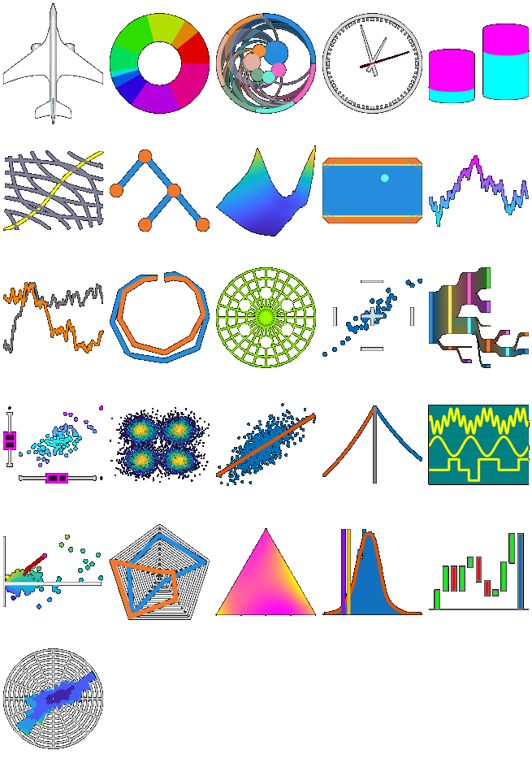

# Chart Examples

## Overview

This toolbox contains the MATLAB® code and examples for the technical article [_Creating Specialized Charts with MATLAB Object-Oriented Programming_](https://www.mathworks.com/company/newsletters/articles/creating-specialized-charts-with-matlab-object-oriented-programming.html).

A chart provides a task-specific application programming interface (API) for creating custom visualizations. Designing and implementing a chart not only provides a convenient API for end users, but simultaneously removes the need for the user to manipulate low-level graphics objects.

The toolbox comprises several diverse examples of custom MATLAB charts, together with an app for browsing the available charts and their documentation.

You can inspect the source code, explore the features and functionality, and run examples demonstrating the use of each chart. The toolbox also has documentation and resources to help you develop your own charts.

## Chart List

* `AircraftChart`: Visualize an aircraft and modify its roll, pitch, and yaw
* `AnnulusChart`: Visualize relative proportions in a data vector using an annulus (ring)
* `CircularNetFlowChart`: Show directed to/from relationships between pairs of categories
* `ClockChart`: Display an analog clock, using a timer to schedule regular updates
* `CylinderChart`: Plot data using stacked cylinders
* `EdgeworthBowleyChart`: Plot the utility curves of two individuals and the derived Pareto-efficient contract curve
* `GraphicsHierarchyChart`: Visualize the graphics hierarchy descending from a given graphics object
* `ImpliedVolatilityChart`: Plot an implied volatility surface as a function of the option strike price and time to expiry
* `LineGradientChart`: Plot a variable-color curve against a date/time vector
* `LineSelectorChart`: Display a collection of line plots and select one to highlight
* `PolarChart`: Polar line graph of dependent numeric variables plotted against independent circular data
* `RadarScope`: Plot a set of blips on a radar scope and issue proximity alerts
* `RangefinderChart`: Bivariate scatter plot showing the crossover point of the marginal medians and lines indicating the marginal adjacent values
* `SankeyChart`: Illustrate the flow between different states
* `ScatterBoxChart`: Bivariate scatter plot with marginal boxplots
* `ScatterDensityChart`: Bivariate scatter plot using color to indicate relative density of the data points
* `ScatterFitChart`: Manage bivariate scattered data together with the line of best fit
* `SettlementChart`: Plot in the money option prices against strike prices
* `SignalTraceChart`: Plot non-overlapping signal traces against a numeric time vector
* `SnailTrailChart`: Plot excess returns against tracking errors for an asset relative to a benchmark
* `SpiderChart`: Plot and compare values from distinct measurements on a web
* `TernaryChart`: Barycentric plot of three variables summing to a constant
* `ValueAtRiskChart`: Plot the distribution of a return series together with its value at risk metrics and a distribution fit
* `WaterfallChart`: Cumulative bar chart visualizing the evolution of an initial value
* `WindRoseChart`: Display wind speed and direction data on a polar histogram

## Installation and Getting Started
This submission is a MATLAB toolbox.
1. Double-click on the toolbox installer (the `.mltbx` file) to install the toolbox.
2. See the `GettingStarted.m` guide for introductory information.
3. Open the `Chart Browser` app from the Apps gallery to access further documentation resources and view the example charts.

## [MathWorks](https://www.mathworks.com) Product Requirements

This toolbox requires MATLAB release R2025a or later.
- [MATLAB](https://www.mathworks.com/products/matlab.html)

Some example charts in the toolbox rely on additional toolboxes.

## License
The license is available in the [LICENSE.txt](LICENSE.txt) file in this GitHub repository.

_Copyright 2018-2025 The MathWorks, Inc._