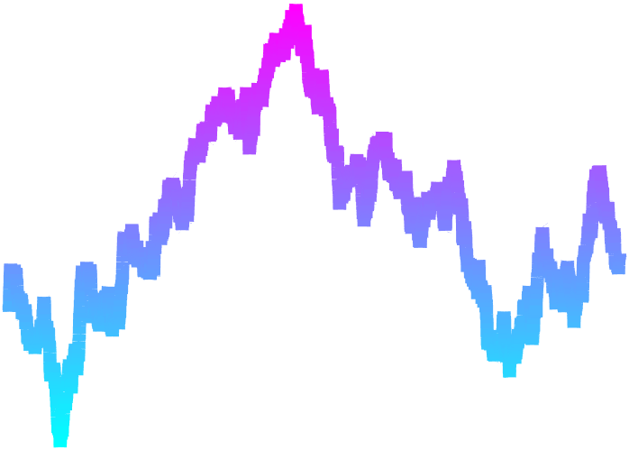

# Line Gradient Chart

Plot a variable-color curve.

* [Class Documentation and Examples](LineGradientChartClassReference.md)
* [Source Code Listing](LineGradientChartSourceCode.md)
* [Unit Test Listing](LineGradientChartUnitTest.md)
