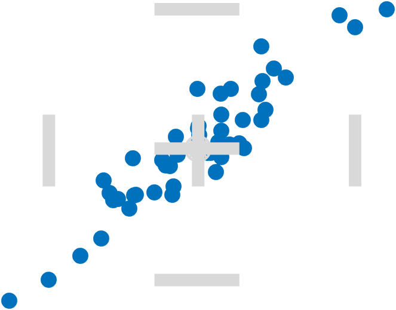

# `RangefinderChart`

Show median crossover and marginal adjacent values.

* [Class Documentation and Examples](RangefinderChartClassReference.md)
* [Source Code Listing](RangefinderChartSourceCode.md)
* No chart-specific test code listing exists.

