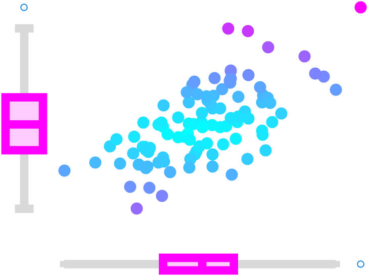

# Scatter Box Chart

Combine a scatter plot with marginal box plots.

* [Class Documentation and Examples](ScatterBoxChartClassReference.md)
* [Source Code Listing](ScatterBoxChartSourceCode.md)
* [Unit Test Listing](ScatterBoxChartUnitTest.md)
