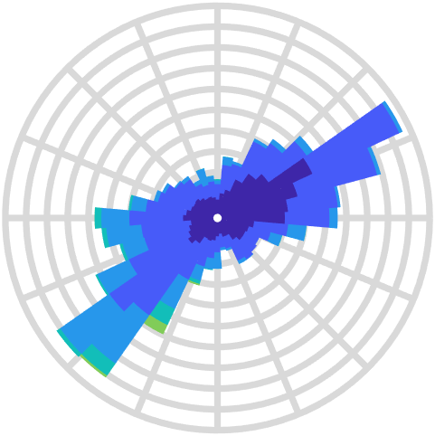

# `WindRoseChart`

Display wind speed and direction on a polar histogram.

* [Class Documentation and Examples](WindRoseChartClassReference.md)
* [Source Code Listing](WindRoseChartSourceCode.md)
* No chart-specific test code listing exists.

