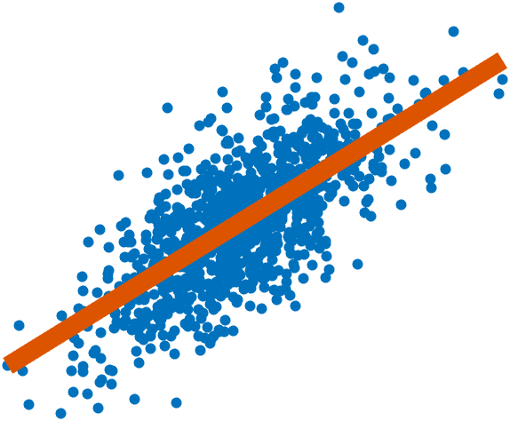

# Scatter Fit Chart

Manage bivariate scattered data together with the line of best fit

* [Class Documentation and Examples](../references/ScatterFitChartClassReference.md)
* [Source Code Listing](../source/ScatterFitChartSourceCode.md)
* [Test Code Listing](../tests/ScatterFitChartUnitTest.md)
