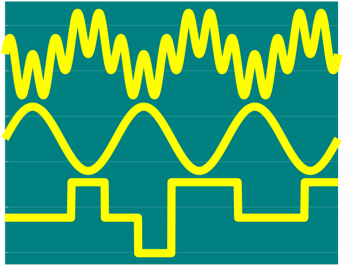

# Signal Trace Chart

Plot non-overlapping signal traces against a numeric time vector

* [Class Documentation and Examples](../references/SignalTraceChartClassReference.md)
* [Source Code Listing](../source/SignalTraceChartSourceCode.md)
* [Test Code Listing](../tests/SignalTraceChartUnitTest.md)
