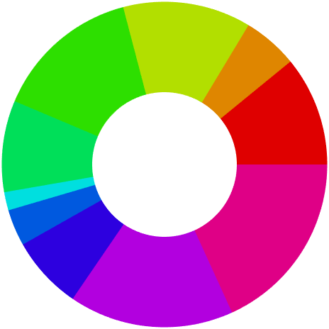

# `AnnulusChart`

Visualize relative proportions in a data vector using an annulus.

## Overview

The `AnnulusChart` comprises a ring, or annulus, divided into separate sections. There is one section for each element of the chart data (a nonempty numeric vector of positive values). Each section shows the contribution of the corresponding data value to the entire data set. The volume of each section is proportional to the contribution of the specific data value to the sum of the data values.
The wedges comprising the chart can be individually exploded programmatically or via user interaction. Clicking on a wedge once will explode it radially outwards. Clicking on the same wedge a second time will restore its original position.



## Syntax

```matlab
AnnulusChart()
AnnulusChart(name, value, ...)
AC = AnnulusChart(name, value, ...) 
```

## Input Arguments

All `AnnulusChart` inputs are optional name-value arguments.

## Properties

| Name | Description | Type | Default Value | Access |
| --- | --- | --- | --- | --- |
| `Data` | Chart data, comprising a positive vector. | `double` | none | public |
| `FaceColor` | Wedge face colors. | not specified | none | public |
| `LabelText` | Wedge label text. | `string` | none | public |
| `LabelFontSize` | Wedge label font size. | `double` | none | public |
| `LabelPercentages` | Specifies whether percentages are shown on the labels. | `matlab.lang.OnOffSwitchState` | none | public |
| `LabelVisible` | Visibility of the wedge labels. | `matlab.lang.OnOffSwitchState` | none | public |
| `LegendText` | Legend text. | `string` | none | public |
| `LegendPercentages` | Specifies whether percentages are shown in the legend. | `matlab.lang.OnOffSwitchState` | none | public |
| `LegendColor` | Legend color. | not specified | none | public |
| `LegendLocation` | Legend location. | `string` | none | public |
| `LegendNumColumns` | Number of columns in the legend. | `double` | none | public |
| `LegendOrientation` | Legend orientation. | `string` | none | public |
| `LegendTitle` | Legend title. | `string` | none | public |
| `LegendVisible` | Visibility of the chart legend. | `matlab.lang.OnOffSwitchState` | none | public |
| `LegendFontSize` | Font size used in the legend. | `double` | none | public |
| `LegendBox` | Box property of the legend. | `matlab.lang.OnOffSwitchState` | none | public |
| `Controls` | Chart controls. | `matlab.lang.OnOffSwitchState` | none | public |
| `DataPercentages` | Chart data, in percentage form. | `double` | none | read-only |

## Methods

| Name | Description |
| --- | --- |
| `retract` | Retract all wedges. |
| `explode` | Explode wedges. |
| `resetView` | Restore the default chart view. |
| `exportgraphics` | Call `exportgraphics` on the chart. |
| `view` | Call the view function on the chart's axes. |
| `title` | Call `title` on the chart. |

## Documentation

- [`surface`](https://www.mathworks.com/help/matlab/ref/surface.html): Primitive surface plot
- [`patch`](https://www.mathworks.com/help/matlab/ref/patch.html): Plot one or more filled polygonal regions

## Examples

### Define the chart data.

The chart data comprises a nonempty numeric vector of positive values. For example, let's take a random permutation of the integers from 1 to 10.

```matlab
rng( "default" )
data = randperm( 10 );
```

The chart accepts the vector data either as a row or a column, but it is stored within the chart as a column vector.

### Create a figure for the chart.

```matlab
f = exampleFigure( "Name", "AnnulusChart Example" );
```

### Create the chart.

Next, create the chart object, specifying the `Parent` and `Data` properties, and hiding the chart controls to begin with. Use a standard colormap for the wedge face colors.

```matlab
AC = AnnulusChart( "Parent", f, ...
    "Data", data, ...
    "FaceColor", hsv( numel( data ) ), ...
    "Controls", "off" );
```

The resulting chart has default wedge labels and legend entries of the form "`Data k`", where `k` is the corresponding data index.

### Annotate the chart.

The `Annulus` chart is equipped with the **`title`** method for annotation.

```matlab
title( AC, "Annulus Chart", "FontSize", 16 )
```

### Change the wedge label text.

Specify some new text to use for labelling the wedges.

```matlab
AC.LabelText = "Wedge " + (1:numel( data ));
```

### Customize the legend and label appearance.

The legend currently obscures some of the wedge labels, so change its number of columns.

```matlab
AC.LegendNumColumns = 2;
```

We also adjust the legend text, title, and color properties.

```matlab
AC.LegendText = string( 1:numel( data ) );
AC.LegendTitle = "Percentage contributions";
AC.LegendColor = "none";
```

Modify the percentage display in the wedge labels and legend.

```matlab
AC.LegendPercentages = "on";
AC.LabelPercentages = "off";
```

### Modify the chart data.

The chart data can be modified by setting the `Data` property to a new value.

```matlab
AC.Data = AC.Data(1:5);
AC.FaceColor = parula( numel( AC.Data ) );
```

### Define a new data vector.

The previous example set the chart data to another vector of shorter length than the original. We can also change the chart data without changing its length.

```matlab
AC.Data = 1 : numel( AC.Data );
AC.FaceColor = cool( numel( AC.Data ) );
```

### Restore the original data.

The new chart data can also be longer than the existing data.

```matlab
AC.Data = data;
```

### Restore the labels and legend text.

```matlab
AC.LabelText = "Wedge " + (1:numel( data ));
AC.LegendText = string( 1:numel( data ) );
```

### Customize the wedge colors.

If the `FaceColor` property is not specified at the time of creation, then the chart is created using the `hsv` colormap. To change the color of the wedges, specify a new color array.

```matlab
AC.FaceColor = bone( numel( AC.Data ) );
```

### Explode the chart's wedges.

To explode the chart's wedges radially outward, invoke the **`explode`** method.

```matlab
explode( AC )
```

### Retract the wedges.

We retract the wedges to their original positions by invoking the **`retract`** method.

```matlab
retract( AC )
```

### Hide the wedge labels.

The labels can be hidden completely.

```matlab
AC.LabelVisible = "off";
```

### Further wedge label customization.

Let's restore the labels and make the font size slightly smaller.

```matlab
set( AC, "LabelVisible", "on", "LabelFontSize", 8 )
```

### Further legend customization.

The chart provides several further properties for adjusting the legend's appearance.

```matlab
set( AC, "LegendFontSize", 8, "LegendBox", "off" )
```

### Specify a fixed view for the chart.

The `Annulus` chart has the `view` method for setting a specific view. For example, we can set the standard 2D view as follows.

```matlab
view( AC, 2 )
```

### Restore the default view.

```matlab
resetView( AC )
```

### Enable the chart's control panel.

To show the chart's control panel, we set the `Controls` property to `"on"` or use the interactive control in the axes toolbar.

```matlab
AC.Controls = "on";
```

## See Also

* [Annulus Chart](../landing/AnnulusChart.md)
* [Source Code Listing](../source/AnnulusChartSourceCode.md)
* [Test Code Listing](../tests/AnnulusChartUnitTest.md)
* [Chart Reference](../ChartsIndex.md)

