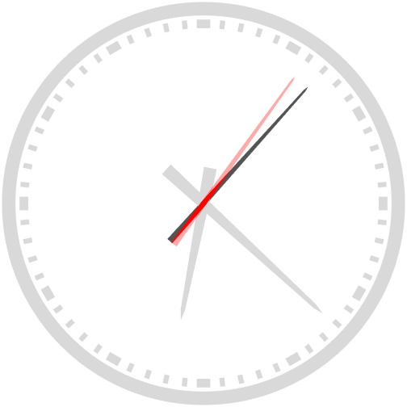

# `ClockChart`

Display an analog clock, using a timer to schedule regular updates

## Overview

The `ClockChart` creates an analog clock backed by a MATLAB `timer` object for timekeeping. This chart illustrates the use of timer objects to schedule chart updates. The timer's callback property **`TimerFcn`** is implemented as a private chart method. The chart also needs to manage the lifecycle of the timer by deleting it when the chart is deleted. We do not have direct access to the chart's destructor method, so the approach is to create a listener to the chart event `ObjectBeingDestroyed`.
```matlabCodeExample
obj.DestructionListener = listener( obj, "ObjectBeingDestroyed", @obj.onChartDeleted ); 
```
The listener callback **`onChartDeleted`** is implemented as a private chart method, and is responsible for safely disposing of the timer.
```matlabCodeExample
function onChartDeleted( obj, ~, ~ )
%ONCHARTDELETED Respond to the destruction of the chart by
%tidying up the timer object.

if obj.Timer.Running == "on"
    stop( obj.Timer )
end % if

delete( obj.Timer )

end % onChartDeleted
```



## Syntax

```matlab
ClockChart()
ClockChart(name, value, ...)
CC = ClockChart(name, value, ...) 
```

## Input Arguments

All `ClockChart` inputs are optional name-value arguments.

## Properties

| Name | Description | Type | Default Value | Access |
| --- | --- | --- | --- | --- |
| `ShowNumbers` | No description available. | `matlab.lang.OnOffSwitchState` | `"on"` | public |

## Methods

| Name | Description |
| --- | --- |
| none | none |

## Documentation

- [`timer`](https://www.mathworks.com/help/matlab/ref/timer.html): Schedule execution of MATLAB commands
- [`patch`](https://www.mathworks.com/help/matlab/ref/patch.html): Create patches of colored polygons
- [`line`](https://www.mathworks.com/help/matlab/ref/line.html): Create primitive line

## Examples

### Create the chart, specifying the parent.

```matlab
f = exampleFigure( "Name", "ClockChart Example", ...
    "Position", [0.25, 0.25, 0.5, 0.5] );

CC = ClockChart( "Parent", f );
```

## See Also

* [Clock Chart](../landing/ClockChart.md)
* [Source Code Listing](../source/ClockChartSourceCode.md)
* [Test Code Listing](../tests/ClockChartUnitTest.md)
* [Chart Examples](../../ChartExamples.md)

