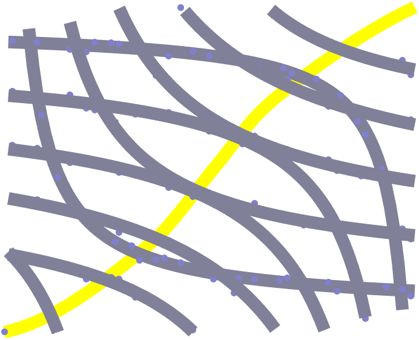

# `EdgeworthBowleyChart`

Plot the utility curves of two individuals and the derived Pareto-efficient contract curve

## Overview

The `EdgeworthBowleyChart` provides a means to represent various distributions of resources. It is a conceptual device for analysing possible trading relationships between two individuals or countries, using indifference curves. It is constructed by taking the indifference map of one individual (B) for two goods (X and Y) and inverting it to face the indifference map of a second individual (A) for the same two goods.



## Syntax

```matlab
EdgeworthBowleyChart()
EdgeworthBowleyChart(name, value, ...)
EBC = EdgeworthBowleyChart(name, value, ...) 
```

## Input Arguments

All `EdgeworthBowleyChart` inputs are optional name-value arguments.

## Properties

| Name | Description | Type | Default Value | Access |
| --- | --- | --- | --- | --- |
| `LineWidth` | Contract line width. | `double` | `1.5` | public |
| `LineColor` | Contract line color. | not specified | `[0 0.5 0]` | public |
| `MarkerSize` | Marker size. | `double` | `8` | public |
| `AData` | Chart A-data: this is a matrix defining the utility curves for | `double` | none | public |
| `BData` | Chart B-data: this is a matrix defining the utility curves for | `double` | none | public |
| `Quantity1` | Quantity of good 1. | `double` | none | public |
| `Quantity2` | Quantity of good 2. | `double` | none | public |

## Methods

| Name | Description |
| --- | --- |
| `axis` | Call `axis` on the chart. |
| `grid` | Call `grid` on the chart. |
| `title` | Call `title` on the chart. |
| `ylabel` | Call `ylabel` on the chart. |
| `xlabel` | Call `xlabel` on the chart. |

## Documentation

- [`fitnlm`](https://www.mathworks.com/help/stats/fitnlm.html): fit a nonlinear regression model

## Examples

### Load some sample chart data.

The chart input data should comprise two matrices, one for individual A and one for individual B. The first column of each matrix should be an equally-spaced, increasing vector with a maximum value of `Quantity1`, the first quantity under consideration.
The subsequent matrix columns are the indifference curves, storing the corresponding quantity of the second resource for the given quantity of the first quantity in the first column. If data is unavailable for the specific point, then it should be represented using a [`NaN`](https://www.mathworks.com/help/matlab/ref/nan.html) (not a number).
It is recommended to create the chart data by starting with matrices of `NaN`s, and then assign the available indifference curve values.
For example, a sample matrix $A$ for the Edgeworth-Bowley chart could be as follows.
$A = \\left\[\\begin{array}{cccccc}0.1 & 9.5 & \\vdots & \\dots & \\vdots & \\text{NaN}\\\\0.2 & 4.5 & \\vdots & \\dots & \\vdots & \\text{NaN}\\\\0.3 & 3 & \\vdots & \\dots & \\vdots & 9.7\\\\\\vdots & \\vdots & \\vdots & \\dots & \\vdots & \\vdots\\\\0.9 & 2.55 & \\vdots & \\dots & \\vdots & 4.55\\\\1.0 & 2.5 & \\vdots & \\dots & \\vdots & 4.5\\end{array}\\right\]$

```matlab
load( fullfile( chartsRoot(), "data", "IndifferenceCurves.mat" ), "A", "B" )
disp("Chart A-data:")
disp(A)
disp("Chart B-data:")
disp(B)
```

### Create the chart, specifying the parent and input data.

```matlab
f = exampleFigure( "Name", "EdgeworthBowleyChart Example" );

EBC = EdgeworthBowleyChart( "Parent", f, ...
    "AData", A, ...
    "BData", B );
```

### Redefine the maximum resource values.

First, increase the quantity of resource 1.

```matlab
EBC.Quantity1 = 12;
```

### Decrease the quantity of resource 1.

```matlab
EBC.Quantity1 = 7;
```

### Increase the quantity of resource 2.

```matlab
EBC.Quantity2 = 13;
```

### Decrease the quantity of resource 2.

```matlab
EBC.Quantity2 = 8;
```

## See Also

* [Edgeworth Bowley Chart](../landing/EdgeworthBowleyChart.md)
* [Source Code Listing](../source/EdgeworthBowleyChartSourceCode.md)
* [Test Code Listing](../tests/EdgeworthBowleyChartUnitTest.md)
* [Chart Examples](../../ChartExamples.md)

