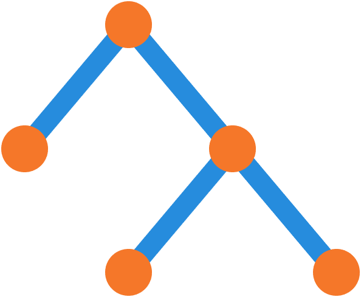

# `GraphicsHierarchyChart`

Visualize the graphics hierarchy descending from a given graphics object

## Overview

The `GraphicsHierarchyChart` visualizes the MATLAB graphics hierarchy descending from a given graphics object using a [`graph`](https://www.mathworks.com/help/matlab/ref/graph.html) plot. This chart is useful when debugging more complex visualizations or application components.
The chart uses a recursive algorithm ([`kids2graph`](../../charts/kids2graph.m)) to find the descendants of the given graphics object representing the root node of the tree. The chart also provides an option to include graphics objects with hidden handles. By default, only descendants with visible handles are shown.
We can use the convenience function [`plotkids`](../../charts/plotkids.m) to create the chart.



## Syntax

```matlab
GraphicsHierarchyChart()
GraphicsHierarchyChart(name, value, ...)
GHC = GraphicsHierarchyChart(name, value, ...) 
```

## Input Arguments

All `GraphicsHierarchyChart` inputs are optional name-value arguments.

## Properties

| Name | Description | Type | Default Value | Access |
| --- | --- | --- | --- | --- |
| `EdgeAlpha` | Edge transparency. | `double` | `0.7` | public |
| `LineWidth` | Edge width. | `double` | `3` | public |
| `MarkerSize` | Node size. | `double` | `8` | public |
| `ShowNodeLabels` | Node label visibility. | `matlab.lang.OnOffSwitchState` | `"on"` | public |
| `RootObject` | Graphics object at the root of the visualization. | not specified | none | public |
| `ShowHiddenHandles` | Logical flag indicating whether to show hidden objects. | `matlab.lang.OnOffSwitchState` | none | public |

## Methods

| Name | Description |
| --- | --- |
| `title` | Call `title` on the chart. |

## Documentation

- [`graph`](https://www.mathworks.com/help/matlab/ref/graph.html): Graph with undirected edges
- [`plot`](https://www.mathworks.com/help/matlab/ref/graph.plot.html): Plot graph nodes and edges
- [`plotkids`](../../charts/plotkids.m): Convenience function for creating a graphics hierarchy chart
- [`kids2graph`](../../charts/kids2graph.m): Construct a graph listing the descendants of the given graphics object

## Examples

### Visualize data using a scatter plot.

Generate random data.

```matlab
rng( "default" )
n = 100;
x = rand( n, 1 );
y = rand( n, 2 );
```

Create the scatter plot.

```matlab
f = figure;
scatter( x, y, "filled" )
legend( "A", "B" )
```

### Visualize the graphics hierarchy under the figure.

```matlab
fchart = exampleFigure( "Name", "GraphicsHierarchyChart Example" );
GHC = plotkids( f, "Parent", fchart );
```

## See Also

* [Graphics Hierarchy Chart](../landing/GraphicsHierarchyChart.md)
* [Source Code Listing](../source/GraphicsHierarchyChartSourceCode.md)
* [Test Code Listing](../tests/GraphicsHierarchyChartUnitTest.md)
* [Chart Examples](../../ChartExamples.md)

