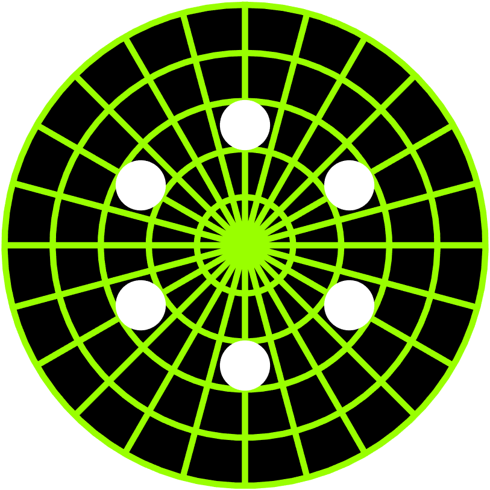

# `RadarScope`

Plot a set of blips on a radar scope and issue proximity alerts

## Overview

The `RadarScope` is a component for displaying a variable number of [`Blip`](../../charts/Blip.m) objects on a scope. Blip objects can be added and removed from the scope. The scope tracks the pairwise proximity of the blips and notifies an event (`NearbyBlipsDetected`) if two blips are close.



## Syntax

```matlab
RadarScope()
RadarScope(name, value, ...)
RS = RadarScope(name, value, ...) 
```

## Input Arguments

All `RadarScope` inputs are optional name-value arguments.

## Properties

| Name | Description | Type | Default Value | Access |
| --- | --- | --- | --- | --- |
| `BackdropColor` | Backdrop color. | not specified | `[0.6 1 0]` | public |
| `BlipColor` | Blip color. | not specified | `[1 1 1]` | public |
| `GridLineWidth` | Grid line width. | `double` | `1.5` | public |
| `GridAlpha` | Grid line transparency. | `double` | `0.25` | public |
| `ShowProximityLamp` | Specify whether the lamp is shown. | `matlab.lang.OnOffSwitchState` | `"on"` | public |
| `Blips` | on the scope. | `Blip` | none | read-only |
| `NearbyBlipsDetectedFcn` | NearbyBlipsDetectedFcn is a generated callback property for the event: NearbyBlipsDetected | not specified | `""` | public |

## Methods

| Name | Description |
| --- | --- |
| `thetalabel` | Call `thetalabel` on the chart. |
| `rlabel` | Call `rlabel` on the chart. |
| `rticklabels` | Call `rticklabels` on the chart. |
| `rticks` | Call `rticks` on the chart. |
| `thetaticklabels` | Call `thetaticklabels` on the chart. |
| `thetaticks` | Call `thetaticks` on the chart. |
| `removeBlip` | Remove a blip from the scope. |
| `addBlip` | Add a blip to the scope. |
| `grid` | TITLE Customize the chart grid. |
| `subtitle` | Customize the chart subtitle. |
| `title` | Customize the chart title. |

## Documentation

- [`polaraxes`](https://www.mathworks.com/help/matlab/ref/polaraxes.html): Create polar axes
- [`polarplot`](https://www.mathworks.com/help/matlab/ref/polarplot.html): Plot line in polar coordinates
- [`text`](https://www.mathworks.com/help/matlab/ref/text.html): Add text descriptions to data points
- [`uilabel`](https://www.mathworks.com/help/matlab/ref/uilabel.html): Create label component
- [`uilamp`](https://www.mathworks.com/help/matlab/ref/uilamp.html): Create lamp component
- [`pdist`](https://www.mathworks.com/help/stats/pdist.html): Pairwise distance between pairs of observations

## Examples

### **Import the blip data.**

```matlab
blipFile = fullfile( chartsRoot(), "data", "Blips.csv" );
blipData = readtable( blipFile, "TextType", "string" );
disp( blipData )
```

### Create a figure for the radar scope.

```matlab
f = exampleFigure( "Name", "RadarScope Example" );
```

### Create the radar scope.

```matlab
RS = RadarScope( "Parent", f );
```

### Create an array of blips and add them to the scope.

```matlab
for k = height( blipData ) : -1 : 1
    B(k, 1) = Blip( "Position", [blipData.Theta(k), blipData.Rho(k)], ...
        "String", blipData.Tag(k) );
    RS.addBlip( B(k, 1) )
end % for
```

### Set a callback function to respond to nearby blips being detected.

```matlab
RS.NearbyBlipsDetectedFcn = @( s, e ) disp( "Proximity alert!" );
```

### Move one of the blips.

```matlab
theta = linspace( 0, 2 * pi ).';
for k = 1 : numel( theta )
    B(1).Position(1) = theta(k);
    pause( 0.1 )
end % for
```

## See Also

* [Radar Scope](../landing/RadarScope.md)
* [Source Code Listing](../source/RadarScopeSourceCode.md)
* [Test Code Listing](../tests/RadarScopeUnitTest.md)
* [Chart Reference](../ChartsIndex.md)

