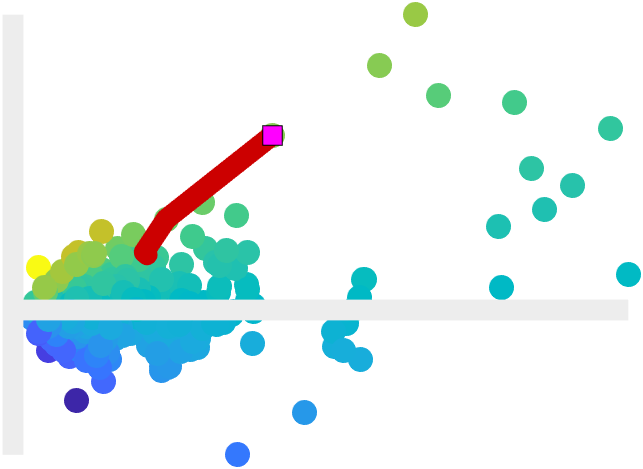

# `SnailTrailChart`

Plot excess returns against tracking errors for an asset relative to a benchmark

## Overview

The `SnailTrailChart` visualizes the evolution of the relative performance of an asset over time. The chart data (`Returns`) comprises a timetable with row times and variables as follows:
- `Date` - the row times of the timetable - an increasing `datetime` vector corresponding to the benchmark and asset returns;
- `Benchmark` - a numeric vector containing the return series for the performance benchmark (for example, the performance benchmark could be the returns of the FTSE100 or S&P500 indices, or another reference portfolio);
- `Asset` - a numeric vector containing the return series for the asset of interest (for example, a portfolio).
From the chart data, the following performance metrics are computed in rolling windows:
- Excess return - the mean of the difference between the asset and the benchmark returns;
- Tracking error - the standard deviation of the difference between the asset and the benchmark returns;
- Information ratio - the ratio of the excess return to the tracking error.
The chart creates a scatter graph of excess return against tracking error, colored by information ratio. The reference lines $x=0$ and $y=0$ are highlighted to separate the two quadrants for which $x\>0$. The snail trail is plotted over the scatter graph, and comprises a head and a trail. A text box displays the performance statistics corresponding to the position of the head.



The `Period` property of the chart specifies the window length (that is, the number of observations used in each rolling window). The head of the trail is set using either the `CurrentIndex` (an integer) or `CurrentDate` (a `datetime`) chart properties. The length of the trail is controlled by modifying the `TrailLength` property. To move the snail trail around the chart, use the `step`, `animate` and `reset` methods.

## Syntax

```matlab
SnailTrailChart()
SnailTrailChart(name, value, ...)
STC = SnailTrailChart(name, value, ...) 
```

## Input Arguments

All `SnailTrailChart` inputs are optional name-value arguments.

## Properties

| Name | Description | Type | Default Value | Access |
| --- | --- | --- | --- | --- |
| `MarkerSize` | Marker size. | `double` | `8` | public |
| `CrossHairLineWidth` | Cross hair line width. | `double` | `3` | public |
| `TrailLineWidth` | Snail trail line width. | `double` | `2` | public |
| `Returns` | Chart data, comprising a timetable with two return series. | `timetable` | none | public |
| `TrailLength` | Number of points in the trail, including the head. | `double` | none | public |
| `CurrentIndex` | Index of the snail's current position. | `double` | none | public |
| `CurrentDate` | Current date. | `datetime` | none | public |
| `Period` | Number of observations used for the window size in the rolling | `double` | none | public |
| `Controls` | Visibility of the chart controls. | `matlab.lang.OnOffSwitchState` | none | public |
| `ShowCurrentPointDetails` | Visibility of the current point information. | `matlab.lang.OnOffSwitchState` | none | public |
| `PerformanceStatistics` | Performance statistics. This is a table comprising a datetime | `timetable` | none | read-only |

## Methods

| Name | Description |
| --- | --- |
| `animate` | Animate the snail trail. |
| `rewind` | Rewind the snail trail. |
| `step` | Increment/decrement the trail by the given number of |
| `exportgraphics` | Call `exportgraphics` on the chart. |
| `axis` | Call `axis` on the chart. |
| `colormap` | Call the colormap function on the chart's axes. |
| `colorbar` | Call the colorbar function on the chart's axes. |
| `title` | Call `title` on the chart. |
| `ylabel` | Call `ylabel` on the chart. |
| `xlabel` | Call `xlabel` on the chart. |

## Documentation

- [`scatter`](https://www.mathworks.com/help/matlab/ref/scatter.html): Scatter plot
- [`text`](https://www.mathworks.com/help/matlab/ref/text.html): Add text descriptions to data points

## Examples

### Load the data.

```matlab
load( fullfile( chartsRoot(), "data", "Returns.mat" ), "rets" )
```

### Create the chart.

```matlab
f = exampleFigure( "Name", "SnailTrailChart Example" );

STC = SnailTrailChart( "Parent", f, ...
    "Returns", rets );
```

### Customize the chart appearance.

```matlab
xlabel( STC, "Tracking error", "FontSize", 14 )
ylabel( STC, "Excess return", "FontSize", 14 )
title( STC, "Snail Trail Chart", "FontSize", 16 )
```

### Step the trail.

```matlab
numSteps = 20;
step( STC, numSteps )
```

Adjust the trail length.

```matlab
STC.TrailLength = 15;
```

### Update the chart data.

```matlab
rng( "default" )
sampleRets = 0.25 * randn( height( rets ), 2 );
sampleRets = array2timetable( sampleRets, "RowTimes", rets.Date );
STC.Returns = sampleRets;
```

## See Also

* [Snail Trail Chart](../landing/SnailTrailChart.md)
* [Source Code Listing](../source/SnailTrailChartSourceCode.md)
* [Test Code Listing](../tests/SnailTrailChartUnitTest.md)
* [Chart Reference](../ChartsIndex.md)

