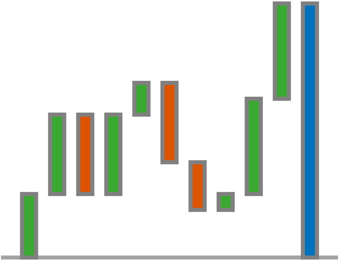

# `WaterfallChart`

Cumulative bar chart visualizing the evolution of an initial value

## Overview

The `WaterfallChart` visualizes the cumulative evolution of an initial value using floating bars to represent each change in the data. The final bar on the right-hand side of the chart represents the sum of the data values. At any given point on the $x$-axis, the chart shows the cumulative sum of the data values up to and including the current point.
The chart data comprises a numeric, real-valued vector `Data`.



## Syntax

```matlab
WaterfallChart()
WaterfallChart(name, value, ...)
WC = WaterfallChart(name, value, ...) 
```

## Input Arguments

All `WaterfallChart` inputs are optional name-value arguments.

## Properties

| Name | Description | Type | Default Value | Access |
| --- | --- | --- | --- | --- |
| `BarEdgeAlpha` | Bar edge alpha. | `double` | `1` | public |
| `BarEdgeColor` | Bar edge color. | not specified | `[0.5 0.5 0.5]` | public |
| `BarFaceAlpha` | Bar face alpha. | `double` | `1` | public |
| `BarLineWidth` | Bar line width. | `double` | `1` | public |
| `BarLineStyle` | Bar line style. | `string` | `"-"` | public |
| `BarVisible` | Bar visibility. | `matlab.lang.OnOffSwitchState` | `"on"` | public |
| `BarLabelFormat` | Bar label format. | `string` | `"%g"` | public |
| `BarLabelFontAngle` | Bar label font angle. | `string` | `"normal"` | public |
| `BarLabelFontColor` | Bar label font color. | not specified | `[0.5 0.5 0.5]` | public |
| `BarLabelFontName` | Bar label font name. | `string` | `"Helvetica"` | public |
| `BarLabelFontSize` | Bar label font size. | `double` | `10` | public |
| `BarLabelFontWeight` | Bar label font weight. | `string` | `"normal"` | public |
| `BarLabelVisible` | Bar label visibility. | `matlab.lang.OnOffSwitchState` | `"on"` | public |
| `BaseLineColor` | Base line color. | not specified | `[0.5 0.5 0.5]` | public |
| `BaseLineStyle` | Base line style. | `string` | `"-"` | public |
| `BaseLineWidth` | Base line width. | `double` | `1` | public |
| `BaseLineVisible` | Base line visibility. | `matlab.lang.OnOffSwitchState` | `"on"` | public |
| `ColorOrder` | Color order. | not specified | `[0.231 0.666 0.196;0.866 0.329 0]` | public |
| `ConnectingLineColor` | Connecting line color. | not specified | `[0.5 0.5 0.5]` | public |
| `ConnectingLineStyle` | Connecting line style. | `string` | `":"` | public |
| `ConnectingLineWidth` | Connecting line width. | `double` | `1` | public |
| `ConnectingLineVisible` | Connecting line visibility. | `matlab.lang.OnOffSwitchState` | `"on"` | public |
| `Interactions` | Axes interactions. | `matlab.lang.OnOffSwitchState` | `"on"` | public |
| `TargetLineColor` | Target line color. | not specified | `[0.5 0.5 0.5]` | public |
| `TargetLineStyle` | Target line style. | `string` | `"-"` | public |
| `TargetLineWidth` | Target line with. | `double` | `1` | public |
| `TargetLineVisible` | Target line visibility. | `matlab.lang.OnOffSwitchState` | `"off"` | public |
| `TargetLineValue` | Target line value. | `double` | `0` | public |
| `TargetLineLabel` | Target line label. | `string` | `""` | public |
| `TotalBarEdgeAlpha` | Total bar edge alpha. | `double` | `1` | public |
| `TotalBarEdgeColor` | Total bar edge color. | not specified | `[0.5 0.5 0.5]` | public |
| `TotalBarFaceAlpha` | Total bar face alpha. | `double` | `1` | public |
| `TotalBarFaceColor` | Total bar face color. | not specified | `[0 0.447 0.741]` | public |
| `TotalBarLineWidth` | Total bar line width. | `double` | `1` | public |
| `TotalBarLineStyle` | Total bar line style. | `string` | `"-"` | public |
| `TotalBarVisible` | Total bar visibility. | `matlab.lang.OnOffSwitchState` | `"on"` | public |
| `Data` | Chart data. | `double` | none | public |
| `BarFaceColor` | Bar face color ("flat" \| "updown" \| single color). | not specified | `"updown"` | public |
| `ColorData` | Color data. | `double` | none | public |
| `LineWidth` | Global line width. | `double` | none | public |
| `BarWidth` | Bar width. | `double` | none | public |

## Methods

| Name | Description |
| --- | --- |
| `axis` | Call `axis` on the chart. |
| `colororder` | Call `colororder` on the chart. |
| `box` | Call `box` on the chart. |
| `grid` | Call `grid` on the chart. |
| `ylim` | Call `ylim` on the chart. |
| `xlim` | Call `xlim` on the chart. |
| `yticklabels` | Call `yticklabels` on the chart. |
| `yticks` | Call `yticks` on the chart. |
| `xticklabels` | Call `xticklabels` on the chart. |
| `xticks` | Call `xticks` on the chart. |
| `subtitle` | Call `subtitle` on the chart. |
| `title` | Call `title` on the chart. |
| `ylabel` | Call `ylabel` on the chart. |
| `xlabel` | Call `xlabel` on the chart. |

## Documentation

- [`patch`](https://www.mathworks.com/help/matlab/ref/patch.html): create patches of colored polygons
- [`bar`](https://www.mathworks.com/help/matlab/ref/bar.html): bar graph
- [`line`](https://www.mathworks.com/help/matlab/ref/line.html): create primitive line
- [`text`](https://www.mathworks.com/help/matlab/ref/text.html): add text descriptions to data points

## Examples

### Create sample chart data.

```matlab
rng( "default" )
data = randi( [-6, 6], 10, 1 );
```

### Create the chart.

```matlab
f = exampleFigure( "Name", "WaterfallChart Example" );

WC = WaterfallChart( "Parent", f, "Data", data );
```

### Annotate the chart.

```matlab
xlabel( WC, "x-data" )
ylabel( WC, "y-data" )
title( WC, "Waterfall Chart" )
grid( WC, "on" )
```

### Customize the chart's appearance.

Define distinct colors to distinguish positive and negative values.

```matlab
WC.BarFaceColor = "updown";
```

Customize the bar labels.

```matlab
WC.BarLabelFormat = "$%.2f";
```

Adjust the bar appearance.

```matlab
set( WC, "BarFaceAlpha", 0.75, "LineWidth", 2, "TotalBarFaceAlpha", 0.75 )
```

### Modify the chart's data.

Generate new data and update the bar colors.

```matlab
newData = randi( [-6, 6], 15, 1 );
WC.Data = newData;
```

### Select a subset of the chart data.

```matlab
WC.Data = WC.Data(1:5);
```

### Customize the base and target lines.

```matlab
set( WC, "BaseLineWidth", 2, ...
    "TargetLineVisible", "on", ...
    "TargetLineValue", 5, ...
    "TargetLineColor", "y", ...
    "TargetLineLabel", "Target", ...
    "TargetLineWidth", 2 )

```

## See Also

* [Waterfall Chart](../landing/WaterfallChart.md)
* [Source Code Listing](../source/WaterfallChartSourceCode.md)
* [Test Code Listing](../tests/WaterfallChartUnitTest.md)
* [Chart Reference](../ChartsIndex.md)

