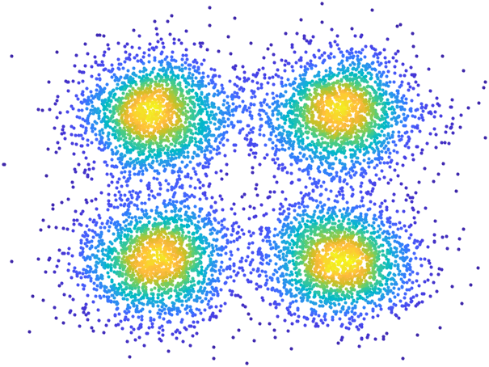

# Scatter Density Chart

## Overview

The `ScatterDensityChart` manages bivariate scattered data and colors the scatter plot markers based on their density. The chart data comprises numeric, real vectors `XData` and `YData`. The chart scatters the `YData` against the `XData`, with the scatter series' `CData` property (the color used for each plot marker) based on the density evaluated by the chart at each point.
The density calculation method is specified by the chart property `DensityMethod`, which is one of the following options.
- `"noboundary"` (the default method): a circle of radius $r$ is drawn around each data point and the density is calculated as the number of data points per unit area inside this circle, excluding the point itself. The radius $r$ is a user-settable parameter, corresponding to the chart property `Radius`. Setting this chart property will update the colors used in the scatter series.
- `"boundary"`: this method first creates a rectangle delimited by the bounds of the chart data, and then the above method is applied, with the difference that only the area surrounding each data point and fully contained within the rectangle is used.
Both methods can be computationally expensive if the number of data points is very large.



## Documentation

- [`pdist2`](https://www.mathworks.com/help/stats/pdist2.html): Pairwise distance between two sets of observations

## Examples

### Create sample x and y data for the chart.

Let's create four clusters of normally-distributed data points.
Start by defining the covariance matrix used for all the clusters.

```matlab
V = 0.2 * eye( 2 );
```

Next, generate random samples with different means.

```matlab
numSamples = 2000;
rng( "default" )
C1 = mvnrnd( [1, 1], V, numSamples);
C2 = mvnrnd( [-1, 1], V, numSamples );
C3 = mvnrnd( [1, -1], V, numSamples );
C4 = mvnrnd( [-1, -1], V, numSamples );
```

Create the chart data vectors.

```matlab
x = [C1(:, 1); C2(:, 1); C3(:, 1); C4(:, 1)];
y = [C1(:, 2); C2(:, 2); C3(:, 2); C4(:, 2)];
```

### Create a figure for the chart.

```matlab
f = exampleFigure( "Name", "ScatterDensityChart Example" );
```

### Create the chart.

```matlab
SDC = ScatterDensityChart( "Parent", f, ...
    "XData", x, ...
    "YData", y );
```

### Annotate the chart.

```matlab
xlabel( SDC, "x-data", "FontSize", 14 )
ylabel( SDC, "y-data", "FontSize", 14 )
title( SDC, "Scatter Density Chart", "FontSize", 16 )
grid( SDC, "minor" )
legend( SDC, "Sample data", "FontSize", 12 )
```

### Increase the chart's marker size.

We can adjust the size of the markers in two ways. First, the `SizeData` property can be a scalar value, which applies the same size to all the data points.

```matlab
SDC.SizeData = 100;
```

### Equip the data points with variable marker sizes.

The `SizeData` property can be a vector of sizes, one element for each data point.

```matlab
SDC.SizeData = randi( 500, size( SDC.XData ) );
```

### Change the colormap used in the chart.

The chart is equipped with the `colormap` method for modifying the color scheme used for the data points, and the `colorbar` method to provide control over the chart's colorbar.
Change the colormap.

```matlab
colormap( SDC, "turbo" )
```

Annotate the chart's colorbar.

```matlab
cb = colorbar( SDC );
cb.Location = "southoutside";
ylabel( cb, "Scatter density" )
```

The `ScatterDensity` chart has the `CLim` property, which is a 2-element vector used to set a custom range for the color limits. The first element of CLim specifies the data value to map to the first color in the colormap, and the second specifies the data value to map to the last color.

```matlab
SDC.CLim = [0, 1000];
```

### Change the density calculation method.

```matlab
SDC.DensityMethod = "boundary";
legend( SDC, "off" )
colorbar( SDC, "off" )
```

### Adjust the radius parameter used in the density calculation.

```matlab
SDC.Radius = 0.7;
```

### Update the chart data and change the density calculation method.

```matlab
set( SDC, "XData", C1(:, 1), "YData", C1(:, 2) )
SDC.DensityMethod = "noboundary";
SDC.SizeData = 400;
grid( SDC, "off" )
```
