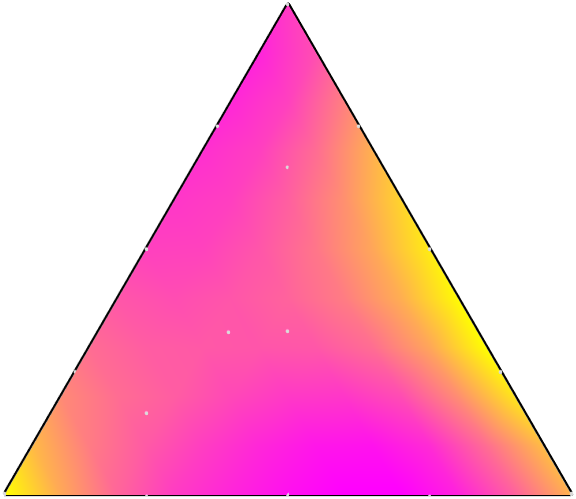

# Ternary Chart

## Overview

The `TernaryChart` manages a barycentric plot of three variables $A$, $B$ and $C$ that sum to a constant. The chart provides a smooth, interpolated surface for the observed data $Z$. The chart data comprises a table of numeric data containing the three input variables $A$, $B$, $C$ together with the response (output) variable $Z$. For each data point $(A\_i, B\_i, C\_i, Z\_i)$ we have $A\_i + B\_i + C\_i=1$. The chart is equipped with a control panel and contains interactive information on the data composition at each specific point via data tips.



## Documentation

- [`patch`](https://www.mathworks.com/help/matlab/ref/patch.html): create a surface plot with variable geometric shapes
- [`line`](https://www.mathworks.com/help/matlab/ref/line.html): create a line with variable properties (used for the discrete points)

## Examples

### Load sample data for the chart.

This data set comprises three chemicals (methanol, acetone and chloroform) together with the bubble point of the ternary mixture at a fixed pressure.

```matlab
load( fullfile( chartsRoot(), "data", "Chemicals.mat" ) )
disp( T )
```

### Create a figure for the chart.

```matlab
f = exampleFigure( "Name", "TernaryChart Example" );
```

### Create the chart.

```matlab
TC = TernaryChart( "Parent", f, ...
    "Data", T );
```

### Annotate the chart.

```matlab
xlabel( TC, "Methanol", "FontSize", 12 )
ylabel( TC, "left", "Acetone", "FontSize", 12 )
ylabel( TC, "right", "Chloroform", "FontSize", 12 )
zlabel( TC, ...
    "Ternary mixture bubble point at 101.325 kPa (" + char( 176 ) + "C)", ...
    "FontSize", 12, "FontWeight", "bold" )
colormap( TC, cool() )
colorbar( TC )
```

### Customize the chart's appearance.

First, adjust the marker size of the discrete data points.

```matlab
TC.MarkerSize = 20;
```

Modify the transparency of the surface.

```matlab
TC.FaceAlpha = 0.75;
```

By default, when the `SurfaceType` is `"surface"`, the `EdgeColor` is `[0, 0, 0]`.

```matlab
TC.EdgeColor = "flat";
```

### Modify the chart's surface type.

The ternary chart supports both the surface and mesh types.

```matlab
TC.SurfaceType = "mesh";
TC.LineWidth = 3;
```

### Modify the chart's grid and ticks.

We can set a new value for the `GridResolution` property.

```matlab
TC.GridResolution = 20;
```

The `TickRate` property controls the number of axes ticks.

```matlab
TC.TickRate = 2;
```

### Adjust the chart's view.

The ternary chart has the view method for adjusting the camera angle. This method has the same syntax as the usual axes [view](https://www.mathworks.com/help/matlab/ref/view.html) function.

```matlab
view( TC, [-2, 55] )
set( TC, "GridResolution", 5, "TickRate", 1 )
```

### Rotate the chart.

We can use the `rotate` method to rotate the chart clockwise or counter-clockwise by 120 degrees.

```matlab
TC.rotate( "clockwise" )
```

### Enable the chart's control panel.

```matlab
TC.Controls = "on";
colorbar( TC, "off" )
```
