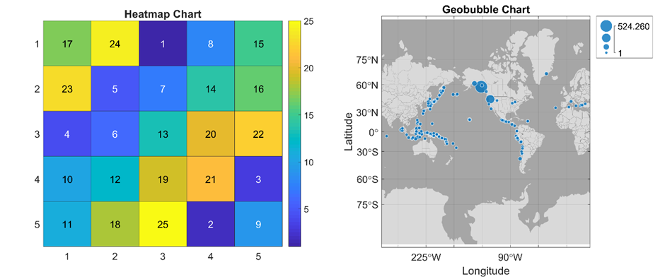

# Chart Development Guide

## Introduction

Developing advanced MATLAB visualizations often involves managing multiple low-level graphics objects. This is especially the case for applications containing graphics that update dynamically. Such applications may require time-consuming programming.

A chart object provides a high-level application programming interface (API) for creating custom visualizations. A chart not only provides a user-friendly and convenient visualization API for the end users; it also removes the need for the user to implement low-level graphics programming.

MATLAB provides an object-oriented framework for developing custom chart classes, via the following container superclasses:

- [`matlab.graphics.chartcontainer.ChartContainer`](https://www.mathworks.com/help/search.html?q=ChartContainer) (available from R2019b), and
- [`matlab.ui.componentcontainer.ComponentContainer`](https://www.mathworks.com/help/search.html?q=ComponentContainer) (available from R2020b).

Using a scatter plot containing the best-fit line as the main example, this document describes design patterns and guidelines for custom chart implementation using this framework. Topics include:

- Writing a standard chart template
- Encapsulating the chart's data and graphics
- Writing the chart's `setup` and `update` methods
- Creating a high-level visualization API for the chart
- Including interactive controls within the chart

## Existing chart examples

Several visualization functions which ship with MATLAB create charts. For example, the [`heatmap`](https://www.mathworks.com/help/search.html?q=heatmap) chart visualizes matrix values overlaid on colored grid squares, and the [`geobubble`](https://www.mathworks.com/help/search.html?q=geobubble) chart provides a quick way to plot discrete data points on a map.



## Writing a standard chart template

Charts are implemented as MATLAB [classes](https://www.mathworks.com/help/matlab/object-oriented-programming.html). The first step when developing a chart is to create the chart's class definition file, using one of the two container superclasses mentioned above. The design patterns and guidelines described in this document are relevant to both container superclasses.

Deciding which superclass to use can be determined by the requirements of the chart. If the chart does **not** require any interactive user-facing controls (e.g., buttons, dropdown menus, or checkboxes) then we derive the chart from [`matlab.graphics.chartcontainer.ChartContainer`](https://www.mathworks.com/help/search.html?q=matlab.graphics.chartcontainer.ChartContainer); otherwise, we derive the chart from [`matlab.ui.componentcontainer.ComponentContainer`](https://www.mathworks.com/help/search.html?q=matlab.ui.componentcontainer.ComponentContainer).

Note that the chart container superclass provides a [`tiledlayout`](https://www.mathworks.com/help/search.html?q=tiledlayout) as the top-level graphics object. A `tiledlayout` object accepts all types of axes to be added to the layout, but does not permit the addition of panels or user-interface controls.

On the other hand, the component container superclass provides a different top-level graphics object which allows the addition of all types of axes as well as panels and user-interface controls.

## The `ScatterFitChart` chart template

Since `ScatterFitChart` is an interactive chart containing various controls, we derive it from the component container.

```
classdef ScatterFitChart < matlab.ui.componentcontainer.ComponentContainer
    %SCATTERFITCHART Chart component managing 2D scattered data (x and y)
    %together with the corresponding best-fit line.

end % classdef
```

This implementation already provides a number of useful features.

- The chart is a [`handle`](https://www.mathworks.com/help/search.html?q=handle) class, which is consistent with other MATLAB graphics objects and means that the chart can be modified in place.
- The chart supports both the dot notation and the `get`/`set` syntax for properties.
- Chart objects are positioned naturally within the MATLAB graphics hierarchy. For example, if we parent the chart object to a figure, the chart is an element of the figure's `Children` property.

### Additional remarks
- The chart is a subclass of [`matlab.mixin.CustomDisplay`](https://www.mathworks.com/help/search.html?q=matlab.mixin.CustomDisplay), so the chart author has the ability to customize the display behavior of the chart by providing implementations of the corresponding protected methods, such as `getHeader`, `getFooter`, `displayScalarObject` etc.
- The chart is a subclass of [`matlab.mixin.Heterogeneous`](https://www.mathworks.com/help/search.html?q=matlab.mixin.Heterogeneous), so concatenating different types of charts to create a chart array is naturally supported.

## Inserting the `setup` and `update` methods

At this point, we cannot create an object from the `ScatterFitChart` class. Attempting to do so causes an error, because both the `ChartContainer` and `ComponentContainer` superclasses require the chart author to implement two special methods:

- [`setup`](https://www.mathworks.com/help/search.html?q=matlab.ui.componentcontainer.ComponentContainer.setup): this method is called automatically when the chart object is created.
- [`update`](https://www.mathworks.com/help/search.html?q=matlab.ui.componentcontainer.ComponentContainer.update): this method is called automatically when the chart user modifies certain properties of the chart object.

```
>> SFC = ScatterFitChart();
Abstract classes cannot be instantiated.  Class 'ScatterFitChart' inherits abstract
methods or properties but does not implement them.  See the list of methods and
properties that 'ScatterFitChart' must implement if you do not intend the class to be
abstract.
 

Abstract methods for class ScatterFitChart:
    update    % defined in matlab.ui.componentcontainer.ComponentContainer
    setup     % defined in matlab.ui.componentcontainer.ComponentContainer
```

These methods are protected (and abstract) in both superclasses, so we also need to implement them as protected methods in any custom chart that we design. We will discuss the purpose and content of the `setup` and `update` methods in more detail later on. For the moment, let's provide stub implementations so that we are able to create a chart object.

```
classdef ScatterFitChart < matlab.ui.componentcontainer.ComponentContainer
    %SCATTERFITCHART Chart component managing 2D scattered data (x and y)
    %together with the corresponding best-fit line.

    methods ( Access = protected )

        function setup( obj )

        end % setup

        function update( obj )

        end % update
   
    end % methods ( Access = protected )

end % classdef
```

To create a chart object, we call the constructor method:

```
SFC = ScatterFitChart();
```
### Remarks
- The chart constructor accepts name-value pairs to allow its properties to be specified on construction, e.g.,

```
f = uifigure();
SFC = ScatterFitChart( "Parent", f, "Visible", "off" );
```
- The chart inherits various important properties, including [`Parent`](https://www.mathworks.com/help/search.html?q=matlab.ui.componentcontainer.ComponentContainer.Parent), [`Units`](https://www.mathworks.com/help/search.html?q=matlab.ui.componentcontainer.ComponentContainer.Units), [`Position`](https://www.mathworks.com/help/search.html?q=matlab.ui.componentcontainer.ComponentContainer.Position), [`Layout`](https://www.mathworks.com/help/search.html?q=matlab.ui.componentcontainer.ComponentContainer.Layout), [`HandleVisibility`](https://www.mathworks.com/help/search.html?q=matlab.ui.componentcontainer.ComponentContainer.HandleVisibility) and [`Visible`](https://www.mathworks.com/help/search.html?q=matlab.ui.componentcontainer.ComponentContainer.Visible). These allow the chart to be resized, hidden, shown, and moved within the graphics hierarchy. We can use the [`properties`](https://www.mathworks.com/help/search.html?q=properties) command to obtain a complete list:

```
properties( SFC )
```
### Additional remarks
- We can also write a constructor method for our chart. One of the main reasons for doing this is to support more informal construction syntax, not involving the specification of name-value pairs.
- For example, we might choose to allow end users to create a `ScatterFitChart` chart using more informal graphics-like syntax as shown below. We would achieve this by writing the chart's constructor method and handling the various possibilities for the input arguments.
- Note that if we write the chart's constructor method, then the constructor is called first, followed by the chart's `setup` method, and finally by the chart's `update` method.

```
f = uifigure();
x = 1:10;
y = rand( size( x ) );
SFC = ScatterFitChart( f, x, y );
```

## The chart's `setup` and `update` methods

All charts must provide implementations of the **`setup`** and **`update`** methods. This requirement is enforced by the chart's superclass. 

### The `setup` method
- The `setup` method runs when the chart is being created. It is called from the superclass constructor.
- Typical responsibilities for the **`setup`** method include initializing and configuring the private, internal graphics and control objects maintained by the chart, as well as preparing the chart's visual layout and appearance.
- The **`setup`** method plays a similar role to the class constructor method. Like the constructor, it is called automatically when a chart object is created, so we should place any code intended to initialize object properties in the **`setup`** method.

```
function setup( obj )
%SETUP Initialize the chart graphics.

% Define the chart's layout and appearance.

% Create the chart's graphics objects.

% Create the chart's control objects.

end % setup
```

### The `update` method
- The **`update`** method is called whenever an individual public interface property is modified by the chart user via the dot syntax, or once when the user calls the **`set`** function on the chart with a list of name-value pair arguments comprising public interface chart properties. In the latter situation, the chart passes through the **`set`** method for each property (if these exist) before invoking its `update` method. Note that the **`update`** method is only called once for each call to the `set` function.
- When writing the **`update`** method, it is important to distinguish between chart modifications that require (expensive) computation and those that only require (much cheaper) modification of decorative properties of the chart's graphics. This is easy to implement using an if statement to check the value of the internal property **`ComputationRequired`** which keeps track of whether a full update is required.
- We should always refresh the chart's decorative properties by mapping the high-level object properties to the corresponding low-level graphics objects properties. This can be done at the end of the **`update`** method, after the `if` statement used to determine whether a full update is needed. There is minimal overhead associated with this, even if the chart's decorative properties have not changed.

```
function update( obj )
%UPDATE Refresh the chart graphics.

% Check whether a full update is required.
if obj.ComputationRequired
                
% Perform the corresponding updates and computations.
% ...

    % Mark the chart clean.
    obj.ComputationRequired = false();
                
end % if
            
% Refresh the chart's decorative properties.
% ...
     
end % update
```

## The chart's data properties

One of the most important behavioral features of a chart is that its graphics objects should update automatically when its underlying data is modified by the user. 

We achieve this using the following steps.

1. Define the underlying chart data as public properties of the chart class. This enables the chart users to access and modify the chart's data.
2. Implement any associated changes to the chart's graphics objects within the [`update`](https://www.mathworks.com/help/search.html?q=matlab.ui.componentcontainer.ComponentContainer.update) method. The **`update`** method is called automatically when the end user sets any of the chart's public properties. This is a feature of the chart and component development framework.

### Remarks
- The chart's data properties are part of the chart's public interface. The `update` method is not, and it is not possible for chart users to invoke the **`update`** method directly (it is a protected method).
- When one or more of the chart's data properties are changed, the chart may need to perform internal computations using the new data. This code could be computationally expensive. For example, certain types of chart may need to solve an optimization problem, or perform other potentially time-consuming operations. Since the chart's **`update`** method is called whenever any public property is set, including chart properties which are not data properties, we treat the chart's data properties separately in the **`update`** method. This avoids executing unnecessary code when other (non-data) chart properties are set by the end user.

In the `ScatterFitChart`, the data properties are **`XData`** and **`YData`**. These allow the chart user to modify the $x$ -data and $y$ -data of the scatter plot separately (or set both properties together).

```
classdef ScatterFitChart < matlab.ui.componentcontainer.ComponentContainer

    properties ( Dependent )
        % Chart x-data.
        XData(:, 1) double {mustBeReal}
        % Chart y-data.
        YData(:, 1) double {mustBeReal}
    end % properties ( Dependent )

end % classdef
```

We implement as much validation as possible for each data property within this properties block. In this example, both **`XData`** and **`YData`** should be real column vectors of type [`double`](https://www.mathworks.com/help/search.html?q=double). MATLAB performs the property validation in the following order:

- Data type (e.g., **`double`**); note that values convertible to the specified data type will be converted automatically.
- Size (e.g., `(:, 1)`); note that compatible shapes will be converted to the specified size (e.g., a row vector will be converted to a column vector).
- Validation functions listed in curly braces `{}`, evaluated from left to right.

For more information, see [Validate Property Values](https://www.mathworks.com/help/matlab/matlab_oop/validate-property-values.html) in the documentation.

In this example, which is typical, we use the **`Dependent`** attribute for the data properties. In many cases the chart's data properties depend on each other. A common situation is that the data properties should have the same length. 

Dependent properties are not stored properties, but rather their values are computed on-the-fly using a special method known as a get method, which has a standard syntax.

```
function value = get.XData( obj )

end % get.XData
```

Each dependent property in the class must have a corresponding get method in order to define its value. If we also require the property to be modified by the end user, then we also need to write a corresponding set method for the property. Set methods are invoked automatically whenever the end user modifies the property value. Set methods are also implemented using a standard syntax.

```
function set.XData( obj, value )

end % set.XData
```

For more information, see [Set and Get Methods for Dependent Properties](https://www.mathworks.com/help/matlab/matlab_oop/access-methods-for-dependent-properties.html) in the documentation. Implementing property validation for each data property within the properties block simplifies their corresponding **`set`** methods. We'll discuss the chart's get and set methods in more detail later on.

Occasionally we need to set a default value for the chart's dependent data properties. This is because certain combinations of property validation functions require a default value to be set, otherwise, an error occurs when creating the object. For example, the [`mustBeNonempty`](https://www.mathworks.com/help/search.html?q=mustBeNonempty) validation function requires a nonempty default value to be set for the corresponding property.

## The chart's decorative properties

Next, we focus on the remaining parts of the chart's public API. To make the chart easy to customize, we can provide public, user-settable properties which are mapped onto the chart's internal private graphics objects.

First, we can define the decorative, stylistic chart properties, such as colors, line widths, markers, etc. When these are changed, the chart does not need to perform any computation, but rather should modify the corresponding properties of its internal graphics objects.

```
classdef ScatterFitChart < matlab.ui.componentcontainer.ComponentContainer

    properties
        % Size data for the scatter series.
        SizeData = 36
        % Color data for the scatter series.
        CData = [0, 0.4470, 0.7410]
    end % properties

end % classdef
```

The code for modifying the properties of the internal graphics objects can be implemented in the chart's **`update`** method.

### Remarks
- Note that these properties should be assigned default values, because the chart's **`update`** method is invoked automatically after the chart object is constructed. If no default value is provided, then the **`update`** method will error when attempting to set the properties on the internal graphics objects.
- We choose not to put any property validation here, because the chart's underlying graphics objects implement their own property validation.

## The chart's dependent decorative properties

Next, we define a properties block containing the chart's dependent decorative properties. These are part of the chart's public API and are similar to the decorative properties discussed above. 

Any decorative properties which are associated with the chart's user-facing controls will fall into this category. 

For example, if the chart has a control to allow the user to select the marker of a line, then the corresponding chart property will be dependent. If the user programmatically sets the marker, then the **`set`** method for the property will need to update the control to display the correct marker. If the **`set`** method for a property `X` needs to access another property, then the property `X` needs to be dependent.

If the chart can be modified by the user programmatically or interactively, then it is essential that the chart's graphics objects are kept synchronized. As a general principle, anything that can be done from the chart's graphical interface should also be doable programmatically. A good example, common to many charts, is using a toggle button to hide or show the chart's control panel (if the chart has one).

```
classdef ScatterFitChart < matlab.ui.componentcontainer.ComponentContainer
       
    properties ( Dependent )        
        % Visibility of the best-fit line.
        LineVisible(1, 1) matlab.lang.OnOffSwitchState
        % Width of the best-fit line.
        LineWidth(1, 1) double {mustBePositive, mustBeFinite}
        % Style of the best-fit line.
        LineStyle(1, 1) string {mustBeLineStyle}
        % Scatter series marker.
        Marker(1, 1) string {mustBeMarker}
        % Color of the best-fit line.
        LineColor
        % Axes x-grid.
        XGrid(1, 1) matlab.lang.OnOffSwitchState
        % Axes y-grid.
        YGrid(1, 1) matlab.lang.OnOffSwitchState
        % Visibility of the chart controls.
        Controls(1, 1) matlab.lang.OnOffSwitchState
    end % properties ( Dependent )

end % classdef
```
### Remarks
- Since these properties have public set access, it is good practice to add property validation.

## The chart's private properties

Next, we define the private, stored data properties maintained by the chart.

These properties include:

- Internal storage for the chart's public data interface properties. By convention, we name these using an underscore at the end of the property name, e.g., `XData_` is the internal stored property corresponding to the public interface property `XData`.
- Any other internal items of data which require storage can be defined here. This includes the logical scalar property `ComputationRequired` to keep track of whether a full, potentially computationally expensive chart update is required, or whether only a cheaper, faster graphics update is required.

```
classdef ScatterFitChart < matlab.ui.componentcontainer.ComponentContainer       
    
    properties ( Access = private )
        % Internal storage for the XData property.
        XData_(:, 1) double {mustBeReal} = double.empty( 0, 1 )
        % Internal storage for the YData property.
        YData_(:, 1) double {mustBeReal} = double.empty( 0, 1 )
        % Logical scalar specifying whether a computation is required.
        ComputationRequired(1, 1) logical = false
    end % properties ( Access = private )

end % classdef
```
### Remarks
- These properties are only ever modified by internal code. Property validation guards against internal (developer) errors.
- We assign default values for these properties according to their data type and size. The public static method [`empty`](https://www.mathworks.com/help/search.html?q=empty) is useful here for initializing property values. Every data type in MATLAB has this method (including user-defined types).

## The chart's graphics objects

Charts are responsible for maintaining their graphics objects, which should not be exposed directly to the end user. Encapsulating the graphics objects in the chart prevents unauthorized access, modification and deletion.

The chart's graphics objects should be stored as private properties. Each property stores a reference to a different graphics object maintained by the chart.

It's good practice to use the `Transient` and `NonCopyable` [property attributes](https://www.mathworks.com/help/matlab/matlab_oop/property-attributes.html) in this block, to ensure correct chart behavior when users save, load and copy chart objects.

- `Transient` properties are not saved when the chart object is saved to disk. This prevents duplicate graphics objects from being created when the user loads a chart object.
- `NonCopyable` properties are not copied when the user creates a (deep) copy of the chart object. This prevents two chart objects from referencing the same underyling graphics objects.

### Remarks
- It is helpful to implement property validation in this block because it enables tab completion for properties of these graphics objects when writing code in subsequent chart methods.
- We validate that these properties are either empty or scalar-valued. When the class is initialized, the properties will be assigned an empty initial value by MATLAB before the onscreen graphics object is created in the **`setup`** method.

```
classdef ScatterFitChart < matlab.ui.componentcontainer.ComponentContainer
    
    properties ( Access = private, Transient, NonCopyable )
        % Chart layout.
        LayoutGrid(:, 1) matlab.ui.container.GridLayout {mustBeScalarOrEmpty}
        % Chart axes.
        Axes(:, 1) matlab.graphics.axis.Axes {mustBeScalarOrEmpty}
        % Toggle button for the chart controls.
        ToggleButton(:, 1) matlab.ui.controls.ToolbarStateButton {mustBeScalarOrEmpty}
        % Scatter series for the (x, y) data.
        ScatterSeries(:, 1) matlab.graphics.chart.primitive.Scatter {mustBeScalarOrEmpty}
        % Line object for the best-fit line.
        BestFitLine(:, 1) matlab.graphics.primitive.Line {mustBeScalarOrEmpty}
        % Label to display a summary of the best-fit line statistics.
        SummaryLabel(:, 1) matlab.ui.control.Label {mustBeScalarOrEmpty}
        % Check box for the best-fit line visibility.
        BestFitLineCheckBox(:, 1) matlab.ui.control.CheckBox {mustBeScalarOrEmpty}
        % Spinner for selecting the width of the best-fit line.
        LineWidthSpinner(:, 1) matlab.ui.control.Spinner {mustBeScalarOrEmpty}
        % Dropdown menu for selecting the style of the best-fit line.
        LineStyleDropDown(:, 1) matlab.ui.control.DropDown {mustBeScalarOrEmpty}
        % Dropdown menu for selecting the marker of the scatter plot.
        MarkerDropDown(:, 1) matlab.ui.control.DropDown {mustBeScalarOrEmpty}
        % Pushbutton for selecting the color of the best-fit line.
        LineColorButton(:, 1) matlab.ui.control.Button {mustBeScalarOrEmpty}
        % Check box for the axes' XGrid visibility.
        XGridCheckBox(:, 1) matlab.ui.control.CheckBox {mustBeScalarOrEmpty}
        % Check box for the axes' YGrid visibility.
        YGridCheckBox(:, 1) matlab.ui.control.CheckBox {mustBeScalarOrEmpty}
    end % properties ( Access = private, Transient, NonCopyable )

end % classdef
```

## Other chart properties

Charts, in common with other user-defined classes, may define other property blocks equipped with general sets of attributes as required by the specific implementation.

### Note on the toolbox charts

Example charts in the toolbox define their product dependencies using a constant, hidden property. This property is used by the chart browser, which only shows charts available to the user based on their installed toolboxes. This block is not required for user-authored charts.

## Get and set methods

Any dependent chart property requires a corresponding `get` method to compute its value when required. Similarly, `set` methods are required for dependent properties if these are permitted to be modified by the chart user. A common situation is to have chart data properties which are mutually dependent, e.g., `XData` and `YData` properties which must be synchronized to have the same length.

### Setting the `ComputationRequired` chart property

If we are working with one of the chart's data properties, then when the property is changed by the user we need to refresh some or all of the chart's graphics objects, which is a potentially time-consuming and computationally expensive process. To indicate that a full chart update is required when the property is set, we set the auxiliary internal property `ComputationRequired` (a logical scalar value) to have value `true`.

```
classdef ScatterFitChart < matlab.ui.componentcontainer.ComponentContainer

methods

    function set.XData( obj, value )

        % Mark the chart for an update.
        obj.ComputationRequired = true;

    end % set.XData

end % methods

end % classdef
```

This programming pattern works because MATLAB will call the `set` method for the property before invoking the chart's `update` method, so the logical flag `ComputationRequired` will be up-to-date when its value is checked in the `update` method. 

After performing the required calculations and graphics updates, the `update` method should reset the `ComputationRequired` property to `false`.

```
classdef ScatterFitChart < matlab.ui.componentcontainer.ComponentContainer

    methods ( Access = protected )

        function update( obj )
        %UPDATE Refresh the chart graphics.
    
        if obj.ComputationRequired
        % Potentially time-consuming code goes here.
        % ...
        % ...

        % Mark the chart clean.
        obj.ComputationRequired = false;

        end % if

        end % update

    end % methods

end % classdef
```

### Supporting length changes in the chart's data properties

Standard MATLAB graphics such as `Line` and `Scatter` objects issue a warning, and do not perform a graphics refresh, if one of their data properties (e.g., `XData`) is set to a new value with a different length to the current value. This behavior can be awkward if we intend to update the other data property (e.g., `YData`) in a subsequent operation. User-defined charts can bypass this problem by allowing their data properties to be set independently to take on new values of arbitrary length. A common way to do this is to intercept the user-specified value and either pad or truncate the other data property so as to match up the lengths. For example, in the `ScatterFitChart`, we support arbitrary length changes as follows.

- Check the length of the proposed `XData` vector.
- If the new `XData` is too short, then we truncate the chart's `YData` property (stored internally in `YData_`).
- If the new `XData` is too long, then we pad the chart's `YData` property.
- In both cases, setting the chart's `XData` also triggers a change in the internal, stored `YData_` property.
- The set method for the `YData` property is similar, and changes the `XData_` property as appropriate.

```
classdef ScatterFitChart < matlab.ui.componentcontainer.ComponentContainer

methods

    function set.XData( obj, value )

        % Mark the chart for an update.
        obj.ComputationRequired = true();

        % Decide how to modify the chart data.
        nX = numel( value );
        nY = numel( obj.YData_ );
            
        if nX < nY % If the new x-data is too short ...
            % ... then chop the chart y-data.
            obj.YData_ = obj.YData_(1:nX);
        else
            % Otherwise, if nX >= nY, then pad the y-data.
            obj.YData_(end+1:nX, 1) = NaN;
        end % if
            
        % Set the internal x-data.
        obj.XData_ = value;

    end % set.XData

end % methods

end % classdef
```

### Set methods for the dependent, decorative properties

These chart properties are dependent because when they are set programmatically by the end user, one or more of the chart's internal graphics objects needs to be updated, usually a user-facing control object. The user can change the property either programmatically, or interactively by manipulating the control object.

For example, the `ScatterFitChart` has a dependent, decorative property `LineVisible` which controls the visibility of the best-fit line object `BestFitLine` maintained by the chart. The chart also has an internal property `BestFitLineCheckBox` which is a reference to the `uicheckbox` in the chart's control panel. The `get` and `set` methods for the `LineVisible` property are as follows. Note that the `set` method updates both the `BestFitLine` and the `BestFitLineCheckBox` chart properties.

```
function value = get.LineVisible( obj )
            
    value = obj.BestFitLine.Visible;
            
end % get.LineVisible
        
function set.LineVisible( obj, value )
          
    % Update the property.
    obj.BestFitLine.Visible = value;
    
    % Update the check box.
    obj.BestFitLineCheckBox.Value = value;
            
 end % set.LineVisible
```

## Annotation methods

To provide a convenient and familiar user interface, charts can define their own annotation methods whenever appropriate. Annotation methods should have the same name as (i.e., should *overload*) the corresponding high-level graphics decoration function, e.g., `xlabel`, `title` or `grid`.

Methods in this category include:

- [`xlabel`](https://www.mathworks.com/help/search.html?q=xlabel), [`ylabel`](https://www.mathworks.com/help/search.html?q=ylabel), [`zlabel`](https://www.mathworks.com/help/search.html?q=zlabel)
- [`title`](https://www.mathworks.com/help/search.html?q=title)
- [`grid`](https://www.mathworks.com/help/search.html?q=grid)
- [`legend`](https://www.mathworks.com/help/search.html?q=legend)
- [`alpha`](https://www.mathworks.com/help/search.html?q=alpha)
- [`axis`](https://www.mathworks.com/help/search.html?q=axis)
- x/y/[`zticks`](https://www.mathworks.com/help/search.html?q=zticks), x/y/[`zticklabels`](https://www.mathworks.com/help/search.html?q=zticklabels), x/y/[`ztickangle`](https://www.mathworks.com/help/search.html?q=ztickangle), x/y/[`ztickformat`](https://www.mathworks.com/help/search.html?q=ztickformat)

To call these methods, the user should provide a reference to the chart as the first input argument, followed by any subsequent input arguments. (In fact, if the chart is derived from `matlab.graphics.chartcontainer.ChartContainer`, the first input argument can be omitted, because such charts are detected by the [`gca`](https://www.mathworks.com/help/search.html?q=gca) function (this returns the current axes or chart). However, since charts could also be derived from `matlab.ui.componentcontainer.ComponentContainer`, it is good practice to specify the chart as the first input argument when calling an annotation method.

```
xlabel( SFC, "x-data" )
```

If the particular annotation method supports outputs, then it can be called with an output argument to return a reference to the underlying graphics object for further customization. For example, the [`xlabel`](https://www.mathworks.com/help/search.html?q=xlabel) function usually returns a text object.

```
xl = xlabel( SFC, "x-data" );
```
### Remarks
- In most cases, the overloaded annotation method will invoke its namesake on the chart's axes, passing any user-specified input arguments directly to the namesake.
- The convenience of supporting output arguments outweighs the potential encapsulation breach which occurs if the user queries the method output to obtain a reference to one of the chart's underlying private graphics objects. For example, the `Parent` property of the text object returned by `xlabel` is the underlying axes object, which the user could then manipulate or even delete. However, the benefit is that the chart's axes' x-label can be completely customized, without the need to laboriously define many separate decorative chart properties (e.g., `XLabelFontSize`, `XLabelFontWeight`, ...).
- To support name-value pairs and output arguments, it is convenient to use [`varargin`](https://www.mathworks.com/help/search.html?q=varargin) and [`varargout`](https://www.mathworks.com/help/search.html?q=varargout) when overloading the annotation methods. Both `varargin` and `varargout` are cell arrays, so we use curly braces `{}` to access their contents. The syntax `varargin{:}` produces a comma-separated list of the contents of the cell array `varargin`. To determine the number of output arguments requested by the end user, we use [`nargout`](https://www.mathworks.com/help/search.html?q=nargout). Placing a variable number of output arguments into the cells of the array `varargout` can be done using the syntax `[varargout{1:nargout}]`.
- Calling an annotation method on a chart should, if applicable, result in the corresponding changes being made to the chart's decorative properties. For example, the chart might support both the `grid` method as well as the `XGrid` and `YGrid` decorative properties. Invoking `grid` on the chart should update the `XGrid` and `YGrid` properties as appropriate. The same applies to any of the chart's control objects which need to be synchronized with the annotation methods.

### Examples
- Here is the `xlabel` annotation method for the `ScatterFitChart`.

```
function varargout = xlabel( obj, varargin )
            
    [varargout{1:nargout}] = xlabel( obj.Axes, varargin{:} );
            
 end % xlabel
```
- Here is the `grid` annotation method for the `ScatterFitChart`. Note that `grid` does not return any output argument, and that after `grid` is called on the chart's underlying axes, the chart's decorative properties `XGrid` and `YGrid` need to be updated.

```
function grid( obj, varargin )
            
    % Invoke grid on the axes.
    grid( obj.Axes, varargin{:} )
    
    % Ensure the controls are up-to-date. This can be done by
    % setting the XGrid/YGrid chart properties, which in turn will
    % refresh the controls.
    obj.XGrid = obj.Axes.XGrid;
    obj.YGrid = obj.Axes.YGrid;
            
end % grid
```

## Private methods and local functions

Charts, in common with other user-defined classes, may define private methods or local functions for internal computations. Callback functions corresponding to user-facing chart controls should be implemented as private methods within the chart class.

## Integrating charts with interactive applications

One of the benefits of authoring a specialized chart is that it can be reused in different contexts. Many applications will simply use charts in scripts and functions to create standalone visualizations. On the other hand, charts can be integrated with interactive applications. This applies both to applications created using App Designer as well as those created programmatically.

We can include a chart in an app created with App Designer as follows.

- Open the existing app in App Designer (or create a new app).
- Add a new private property to the app, e.g., `Chart`, to represent the chart.

```
classdef AppWithChart < matlab.apps.AppBase

properties (Access = private)
    % Chart maintained by the app.
    Chart(:, 1) ScatterFitChart {mustBeScalarOrEmpty}
end % properties ( Access = private )

end % classdef
```
- Equip the app with a [startup function](https://www.mathworks.com/help/matlab/creating_guis/app-designer-startup-function.html). Within the app's startup function, create the chart and assign it to the app property above. The chart will be parented to one of the graphics objects within the app, for example, a tab, panel, grid layout or the app's main figure itself.

```
function onStartup( app )

% Create and store the chart object.
app.Chart = ScatterFitChart( "Parent", app.Figure );

end % onStartup
```
