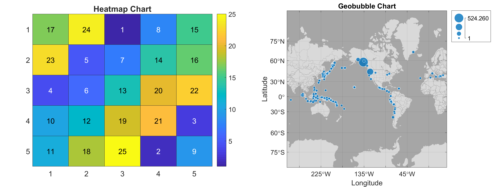
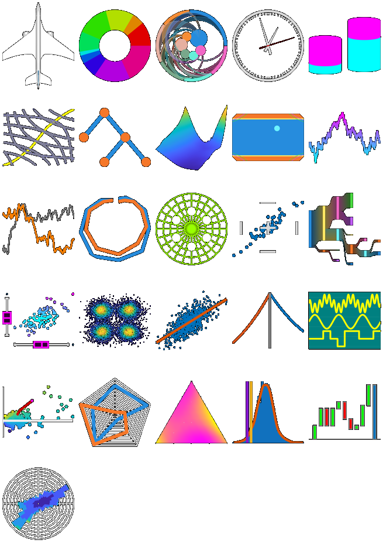
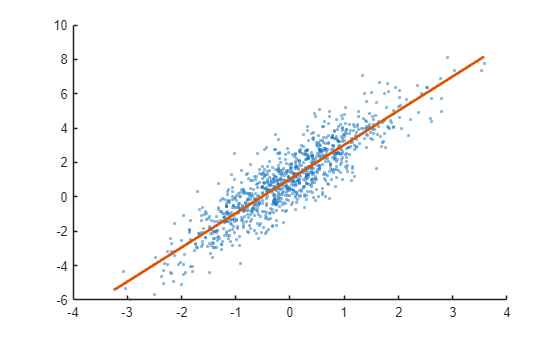
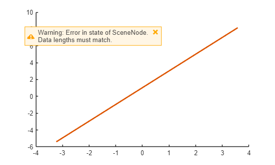
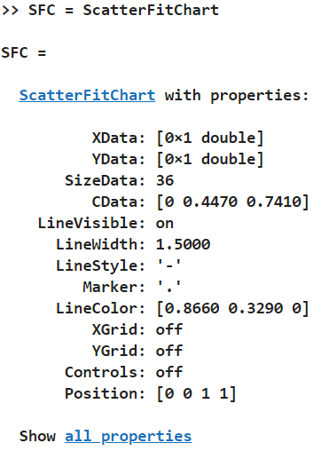
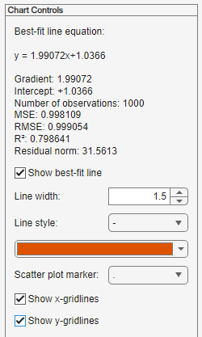
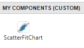

# Creating Specialized Charts with MATLAB Object-Oriented Programming

By Ken Deeley and David Sampson, MathWorks

Developing advanced MATLAB® visualizations often involves managing multiple low-level graphics objects. This is especially the case for applications containing graphics that update dynamically. Such applications may require time-consuming programming.

A *chart* object provides a high-level application programming interface (API) for creating custom visualizations. A chart not only provides a convenient visualization API for your end users; it also removes the need for the user to implement low-level graphics programming.

MATLAB includes an object-oriented framework for developing custom charts via the following container superclasses:

- [`matlab.graphics.chartcontainer.ChartContainer`](https://www.mathworks.com/help/matlab/ref/matlab.graphics.chartcontainer.chartcontainer-class.html) (introduced in R2019b)
- [`matlab.ui.componentcontainer.ComponentContainer`](https://www.mathworks.com/help/matlab/ref/matlab.ui.componentcontainer.componentcontainer-class.html) (introduced in R2020b)

This article provides a step-by-step guide, with design patterns and best practices, to creating and implementing a custom chart using this framework. The steps are illustrated with an example scatter plot containing the best-fit line. Topics include:

- Writing a standard chart template
- Writing the chart's setup and update methods
- Encapsulating data and graphics
- Providing a high-level API for end users
- Including interactive controls

## Chart Examples

Several charts are available in MATLAB, including the [`heatmap`](https://www.mathworks.com/help/matlab/ref/heatmap.html) chart, which visualizes matrix values overlaid on colored grid squares, and the [`geobubble`](https://www.mathworks.com/help/matlab/ref/geobubble.html) chart, which provides a quick way to plot discrete data points on a map (Figure 1).



Figure 1. The `heatmap` and `geobubble` charts.

In addition, we've created several application-specific charts (Figure 2). You can download these charts, together with the MATLAB code used in this article, from [File Exchange](https://www.mathworks.com/matlabcentral/fileexchange/65857-chart-development-toolbox).



Figure 2. Custom charts available for download on File Exchange.

## Creating a 2D Scatter Plot

Let's say we want to create a 2D scatter plot containing the corresponding line of best fit (Figure 3). We could use the [`scatter`](https://www.mathworks.com/help/matlab/ref/scatter.html) function to visualize the discrete $(x,y)$ data points and the [`fitlm`](https://www.mathworks.com/help/stats/fitlm.html) function from Statistics and Machine Learning Toolbox™ to compute the best-fit line.

```matlab
rng("default")
x = randn(1000, 1);
y = 2*x + 1 + randn(size(x));
s = scatter(x, y, 6, "filled", "MarkerFaceAlpha", 0.5);
m = fitlm(x, y);
hold on
plot(x, m.Fitted, "LineWidth", 2)
```



Figure 3. Best-fit line and the underlying scattered data.

The code above is sufficient for static visualizations. However, if the application requires the data to be dynamically modifiable, then we encounter several challenges:

- If we replace the `XData` or `YData` with a new array of the same length as the current `XData`, the best-fit line is not dynamically updated (Figure 4).

```matlab
s.XData = s.XData + 4;
```

Figure 4. The best-fit line is not updated after changing the `XData` of the scatter plot.

The `Scatter` object `s` issues a warning, and performs no graphics update, if either of its data properties (`XData` or `YData`) is set to an array that is longer or shorter than the current array.

```matlab
s.XData = s.XData(1:500);
```



We can resolve these challenges, and others, by designing a chart, which we name `ScatterFitChart`.

## Structuring the Chart Code: Function or Class?

A function encapsulates the code as a reusable unit and lets you create multiple charts without duplicating the code.

```
function scatterfit(varargin)
 
% Ensure 2 or 3 inputs.
narginchk(2, 3)
 
% We support the calling syntax scatterfit(x, y) or 
% scatterfit(f, x, y), where f is the parent graphics.
switch nargin
    case 2
        f = gcf;
        x = varargin{1};
        y = varargin{2};
    otherwise % case 3
        f = varargin{1};
        x = varargin{2};
        y = varargin{3};
end % switch/case
 
% Create the chart axes and scatter plot.
ax = axes("Parent", f);
scatter(ax, x, y, 6, "filled")
% Compute and create the best-fit line.       
m = fitlm(x, y);
hold(ax, "on")
plot(ax, x, m.Fitted, "LineWidth", 2)
hold(ax, "off")
 
end % scatterfit function
```

Note that this function requires the two data inputs (*x* and *y*). You can specify the graphics parent `f` (for example, a figure) as the first input argument.

- `scatterfit(x, y)` specifies the two data inputs.
- `scatterfit(f, x, y)` specifies the graphics parent and the data.

In the first case, the function exhibits *autoparenting behavior* — that is, a figure for the chart will be created automatically.

Using a function to create a chart has some drawbacks:

- You cannot modify the data after the chart has been created.
- To change the chart data, you need to call the function again to recreate the chart.
- It's difficult for the end user to locate configurable chart parameters (e.g., labels and decorative graphics properties such as color, line style, etc).

Implementing the chart as a class has all the benefits of code encapsulation and reusability that the function provides while also letting you modify the chart without needing to recreate it.

## Choosing the Chart Superclass: `ChartContainer` or `ComponentContainer`?

A chart must be implemented as a [`handle`](https://www.mathworks.com/help/matlab/handle-classes.html) class so that it can be modified in place. For consistency with MATLAB graphics objects, charts should support the [`get`](https://www.mathworks.com/help/matlab/ref/get.html)/[`set`](https://www.mathworks.com/help/matlab/ref/set.html) syntax for properties in addition to the standard dot notation. Both `ChartContainer` and `ComponentContainer` are handle classes and provide support for the `get`/`set` syntax, which means that you can derive your custom chart from one of these superclasses.

```
classdef ScatterFitChart < matlab.ui.componentcontainer.ComponentContainer
```

As a result, for any property, the syntax shown in Table 1 is automatically supported.

||||
| :-- | :-- | :-- |
| **Syntax Type**  | **Access**  | **Modification**   |
| Dot notation  | `x = SFC.XData;`  | `SFC.XData = x;`   |
| `get`/`set`  | `x = get(SFC, "XData");`  | `set(SFC, "XData", x)`   |

Table 1. Access and modification syntax for chart properties.

Select a superclass based on the requirements of your chart. If the chart does not require interactive user-facing controls such as buttons, dropdown menus, and checkboxes, then derive the chart from `ChartContainer`; otherwise, use `ComponentContainer`. This is because the chart container superclass provides a [tiled layout](https://www.mathworks.com/help/matlab/ref/tiledlayout.html) as the top-level graphics object, and this object can contain axes but not user controls. The top-level graphics object associated with a component container is a [panel](https://www.mathworks.com/help/matlab/ref/uipanel.html)-like object, which supports both axes and user controls.

Note that the framework superclasses automatically manage the chart life cycle, guaranteeing the following behavior:

- When the chart graphics are deleted (for example, by closing the main figure window), the chart object is deleted.
- When the chart object is deleted (for example, when it goes out of scope or when its handle is deleted), the chart graphics are deleted.

The framework superclasses support the use of name-value pairs for all chart input arguments. This means that no input arguments need to be specified when creating a chart, and all inputs are optional.

## Writing the Chart `setup` and `update` Methods

We now need to implement two special methods, both of which are required by the framework superclasses:

- `setup`: called automatically when the chart is created
- `update`: called automatically when the user modifies certain chart properties

These methods must have protected access in our chart class since they have this attribute in the superclass.

```
classdef ScatterFitChart < matlab.ui.componentcontainer.ComponentContainer

methods (Access = protected)
    
    function setup(obj)
        
    end % setup
    
    function update(obj)
        
    end % update
    
end % methods (Access = protected)

end % classdef
```

Let's look at the `setup` method. This is the function within the class definition where we initialize the chart. A good place to start is to copy the code from the `scatterfit` function to the `setup` method. We then make the following modifications to support the required chart behavior:

- **Parent graphics.** Unlike the approach described above in the `scatterfit` function, if no `Parent` input is specified, then we do not automatically create one for the chart. Note that this behavior is different from that of convenience functions such as `plot` and `scatter`, which exhibit autoparenting. Within the `setup` method, we create our main graphics object (such as an axes, panel, or layout) and assign its parent property to the top-level graphics object provided by the superclass. The [`getLayout`](https://www.mathworks.com/help/matlab/ref/matlab.graphics.chartcontainer.chartcontainer.getlayout.html) method of the `ChartContainer` superclass returns a reference to the top-level tiled layout. For `ComponentContainer` charts, we can simply assign the graphics parent property to the object itself.

```
obj.Axes = axes("Parent", obj.getLayout()); % ChartContainer
obj.Axes = axes("Parent", obj); % ComponentContainer
```

If `Parent` is specified as an input argument, then it will be set automatically by the superclass, together with any other name-value pairs supplied during chart creation. The superclass will assign the user-specified parent as the parent of the top-level graphics object.

- **Chart graphics.** We create and store any graphics objects required by the chart. Most charts will require an axes object together with some axes contents such as line or patch objects. In the `ScatterFitChart` class, we need a `Scatter` object and a `Line` object.

```
obj.ScatterSeries = scatter(obj.Axes, NaN, NaN);
obj.BestFitLine = line(obj.Axes, NaN, NaN);
```

Note that we initialize these graphics with their data properties set to `NaN`. If the user has specified the `XData` and/or `YData` on construction, then we defer updating the scatter plot and best-fit line to the corresponding `set` methods (discussed later). This coding practice ensures that any errors caused by the user when specifying the name-value pairs will be caught and handled separately.

- **Graphics configuration.** We configure the chart graphics by setting any required properties. For example, we may create annotations such as labels or titles, set a specific view of an axes, add a grid, or adjust the color, style or width of a line.

Whenever practical, we use primitive objects (Table 2) to create the chart graphics, because high-level convenience functions reset many existing axes properties when called. However, there are exceptions to this principle: within `ScatterFitChart`, we use the non-primitive function `scatter` to create the graphics object as it supports subsequent changes to individual marker sizes and colors (whereas a single line object does not).

|||
| :-- | :-- |
| **Primitive Graphics Function**  | **High-Level Graphics Function**   |
| `line`  | `plot`   |
| `surface`  | `surf`   |
| `patch`  | `fill`   |

Table 2. Examples of primitive and high-level graphics functions.

We'll return to the chart's `update` method later.

## Encapsulating Chart Data and Graphics

In most charts, the underlying graphics comprise at least one axes object together with their contents (for example, line or surface objects) or axes peer objects (for example, legends or colorbars). The chart also maintains internal data properties to ensure that the public properties are presented correctly to the end user. We store the underlying graphics and internal data as private chart properties. For example, the `ScatterFitChart` maintains the following private properties.

```
classdef ScatterFitChart < matlab.ui.componentcontainer.ComponentContainer

properties (Access = private)
    % Internal storage for the XData property.
    XData_(:, 1) double {mustBeReal} = double.empty(0, 1)
    % Internal storage for the YData property.
    YData_(:, 1) double {mustBeReal} = double.empty(0, 1)
    % Logical scalar specifying whether a computation is required.
    ComputationRequired(1, 1) logical = false()
end % properties (Access = private)

end % classdef
```

We use the naming convention `XData_` to indicate that this is the private, internal version of the chart data. The corresponding public data property visible to the user will be named `XData`.

```
classdef ScatterFitChart < matlab.ui.componentcontainer.ComponentContainer

properties (Access = private, Transient, NonCopyable)        
    % Chart axes.
    Axes(:, 1) matlab.graphics.axis.Axes {mustBeScalarOrEmpty}
    % Scatter series for the (x, y) data.
    ScatterSeries(:, 1) matlab.graphics.chart.primitive.Scatter {mustBeScalarOrEmpty}
    % Line object for the best-fit line.
    BestFitLine(:, 1) matlab.graphics.primitive.Line {mustBeScalarOrEmpty}
end % properties (Access = private, Transient, NonCopyable)

end % classdef
```

Using private properties for internal chart data and graphics serves three main purposes.

- Private properties restrict the visibility of the low-level graphics, hiding implementation details and reducing visual clutter in the chart's API.
- Access to the low-level graphics is restricted, reducing the chance of bypassing the API.
- Chart data can be easily synchronized (for example, we require the `XData` and `YData` properties of `ScatterFitChart` to be related).

For internal graphics properties, it is a good practice to specify the `Transient` and `NonCopyable` attributes. These ensure that the chart object behaves correctly when it is saved to a MAT-file or copied. For additional robustness, and to enable tab completion on the graphics properties when working in the chart class, we also implement property validation.

## Providing a Visualization API

One of the main reasons for designing a chart is to provide a convenient and intuitive API. We equip `ScatterFitChart` with easily recognizable properties, using names consistent with existing graphics object properties (Figure 5).



Figure 5. `ScatterFitChart` API.

Users can access or modify these properties using the sample syntax in Table 1. The associated chart graphics update dynamically in response to property modifications. For example, changing the `LineWidth` property of the chart updates the `LineWidth` of the best-fit line.

We implement parts of the chart's API using `Dependent` properties. A `Dependent` property is one whose value is not stored explicitly, but rather is derived from other properties in the class. In a chart, the `Dependent` properties depend on private properties such as the low-level graphics or internal data properties.

To define a `Dependent` property, we first declare its name in a properties block with attribute `Dependent`. This indicates that the property's value depends on other properties within the class.

```
classdef ScatterFitChart < matlab.ui.componentcontainer.ComponentContainer

properties (Dependent)
    % Chart x-data.
    XData(:, 1) double {mustBeReal}
    % Chart y-data.
    YData(:, 1) double {mustBeReal}
end % properties (Dependent)

end % classdef
```

We also need to specify how the property depends on the other class properties by writing the corresponding `get` method. This method returns a single output argument – namely, the value of the `Dependent` property. In `ScatterFitChart`, the `XData` property of the chart (part of the chart's public interface) is simply the underlying `XData_` property, which is stored internally as a private property of the chart.

```
classdef ScatterFitChart < matlab.ui.componentcontainer.ComponentContainer

function value = get.XData(obj)

    value = obj.XData_;

end % get.XData

end % classdef
```

Each data property also requires a `set` method. This assigns the user-specified value to the correct internal chart property and triggers any necessary graphics updates.

For `ScatterFitChart`, we support dynamic modifications (including length changes) to the data properties (`XData` and `YData`). When the user sets the (public) `XData` of the chart, we either pad or truncate the opposite (private) data property `YData_`, depending on whether the new data vector is respectively longer or shorter than the existing data. Recall that this `set` method will be invoked on construction if the user has specified `XData` when creating the chart.

```
classdef ScatterFitChart < matlab.ui.componentcontainer.ComponentContainer

function set.XData(obj, value)
            
    % Mark the chart for an update.
    obj.ComputationRequired = true();
            
    % Decide how to modify the chart data.
    nX = numel(value);
    nY = numel(obj.YData_);
           
    if nX < nY % If the new x-data is too short then truncate the chart y-data.
        obj.YData_ = obj.YData_(1:nX);
    else
        % Otherwise, if nX >= nY, then pad the y-data.
        obj.YData_(end+1:nX, 1) = NaN;
    end % if
            
    % Set the internal x-data.
    obj.XData_ = value;            
           
end % set.XData

end % classdef
```

Note that the chart's `update` method is invoked automatically whenever the user sets a public property. To avoid unnecessary and time-consuming calculations, we use a private, internal logical property `ComputationRequired` to record, in the `set` methods, whether a full update is necessary.

Public API properties that do not require new computation when they change do not need a `get` or `set` method. Instead, we simply refresh the corresponding internal objects at the end of the `update` method. Typically, public API properties include decorative and cosmetic aspects of the chart such as colors, line widths, and styles, which are inexpensive to update.

In `ScatterFitChart`, the `update` method contains the code necessary to set the new data in the `Scatter` object, recompute the best-fit line and set the new data in the corresponding `Line` object.

```
classdef ScatterFitChart < matlab.ui.componentcontainer.ComponentContainer

function update( obj )

    if obj.ComputationRequired
            
    % Update the scatter series with the new data.
    set(obj.ScatterSeries, "XData", obj.XData_, "YData", obj.YData_)

    % Obtain the new best-fit line. 
    m = fitlm(obj.XData_, obj.YData_);

    % Update the best-fit line graphics.
    [~, posMin] = min(obj.XData_);
    [~, posMax] = max(obj.XData_);
    set(obj.BestFitLine, "XData", obj.XData_([posMin, posMax]), "YData", m.Fitted([posMin, posMax]))

    % Mark the chart clean.
    obj.ComputationRequired = false();
                
    end % if
            
    % Refresh the chart's decorative properties.
    set(obj.ScatterSeries, "CData", obj.CData, "SizeData", obj.SizeData)
        
end % update

end % classdef
```

We implement the `set` method for `YData` in an identical way, switching the roles of the `X`/`YData` properties.

To create a rich API appropriate for end users, we implement a broad set of public properties. Note that standard properties such as `Parent`, `Position`, `Units`, and `Visible` are all inherited from the superclass and do not require additional implementation in the chart.

## Adding Chart Annotation Methods

In the API, we provide familiar and easy-to-use methods for annotating the chart. These annotation methods *overload* (have the same name as) the corresponding high-level graphics decoration function. To use these methods, the user provides a reference to the chart as the first input argument, followed by inputs to the decoration function.

```
xlabel(SFC, "x-data", "FontSize", 12)
```

If supported by the decoration function, the annotation method can also be called with an output to return a reference to the graphics object for further customization. For example, the `xlabel` function returns a text object.

```
xl = xlabel(SFC, "x-data");
```

To support name-value pairs and output arguments, it is convenient to use the cell arrays [`varargin`](https://www.mathworks.com/help/matlab/ref/varargin.html) and [`varargout`](https://www.mathworks.com/help/matlab/ref/varargout.html). The syntax `varargin{:}` produces a comma-separated list of the input arguments. We determine the number of outputs from the caller using [`nargout`](https://www.mathworks.com/help/matlab/ref/nargout.html). To handle a variable number of output arguments (typically, 0 or 1 for these methods) we use the syntax `[varargout{1:nargout}]` when invoking the decoration function. A typical annotation method has the following structure:

```
function varargout = xlabel(obj, varargin)
            
    [varargout{1:nargout}] = xlabel(obj.Axes, varargin{:});
            
end % xlabel
```

## Including Interactive Controls in Charts

In addition to the chart's API, we can include controls that provide end users with options for chart interaction and modification (Figure 6).



Figure 6. Examples of interactive chart controls.

We initialize these controls in the chart `setup` method, using [components for app building](https://www.mathworks.com/help/matlab/creating_guis/choose-components-for-your-app-designer-app.html). Each control has a [callback function](https://www.mathworks.com/help/matlab/creating_plots/create-callbacks-for-graphics-objects.html), implemented as a private method. This method has three input arguments:

- The chart object.
- A reference to the *source* object (the object responsible for triggering the callback)—in this case, the source object is the corresponding user control.
- Event data. This is an object automatically passed to the callback function by MATLAB when the user interacts with the control. The event data object contains additional information about the event.

For example, consider the callback function for the checkbox controlling the visibility of the best-fit line. This function toggles the visibility of the underlying line object based on the value of the checkbox.

```
function toggleLineVisibility(obj, s, ~)
%TOGGLELINEVISIBILITY Toggle the visibility of the best-fit line.

    obj.BestFitLine.Visible = s.Value;
            
end % toggleLineVisibility
```

The values of each control must be synchronized with the corresponding chart property. To achieve this, we equip the chart property with the `Dependent` attribute and then implement its `get` and `set` methods. Note that in addition to updating the internal graphics object, the `set` method must also update the value of the control object.

The code corresponding to the best-fit line visibility is shown below. To ensure compatibility between the property and checkbox values, we convert the property to the [`matlab.lang.OnOffSwitchState`](https://www.mathworks.com/help/matlab/ref/matlab.lang.onoffswitchstate-class.html) type. This type supports any compatible syntax for representing `true` and `false` values, such as `1` and `0`, as well as `"on"` and `"off"`.

```
classdef ScatterFitChart < matlab.ui.componentcontainer.ComponentContainer

properties (Dependent)
    % Visibility of the best-fit line.
    LineVisible(1, 1) matlab.lang.OnOffSwitchState
end % properties (Dependent)

function value = get.LineVisible(obj)
            
value = obj.BestFitLine.Visible;
            
end % get.LineVisible
        
function set.LineVisible(obj, value)
            
% Update the property.
obj.BestFitLine.Visible = value;
% Update the check box.
obj.BestFitLineCheckBox.Value = value;
            
end % set.LineVisible

end % classdef
```

## Integrating Charts with App Designer

As of MATLAB R2021a, charts developed using the `ComponentContainer` superclass can be [integrated with App Designer](https://www.mathworks.com/help/matlab/ref/appdesigner.customcomponent.configuremetadata.html) (Figure 7). With App Designer you can share charts with end users by creating metadata. The installed chart will then appear in the user's App Designer Component Library, where it can be used interactively in the canvas like any other component.



Figure 7. Custom chart integrated with App Designer.

## Summary

In this article, we described design patterns and best practices for the implementation of custom charts, using the `ScatterFitChart` as an example. Many common visualization tasks, especially those that require dynamic graphics, can be performed using an appropriate chart. Designing and creating a chart requires up-front development time and effort, but charts can substantially simplify many visualization workflows.

**Products Used**

MATLAB

Statistics and Machine Learning Toolbox

**Learn More**

[Object-Oriented Programming in MATLAB](https://www.mathworks.com/products/matlab/object-oriented-programming.html) - Overview

[Chart Examples](https://www.mathworks.com/matlabcentral/fileexchange/65857-chart-development-toolbox) - Downloadable Code
