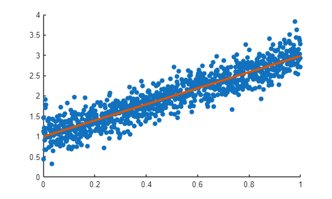
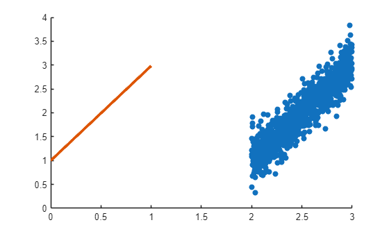
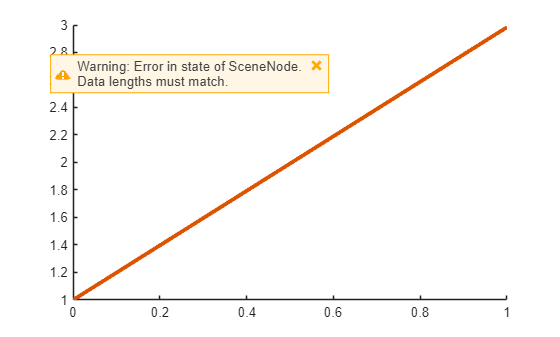
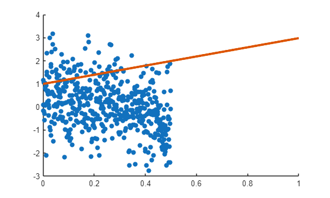
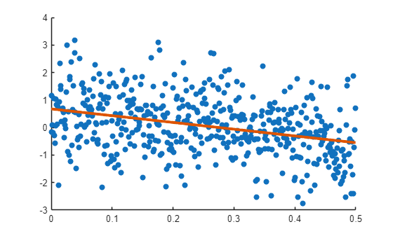

# What is a Chart?

This script aims to provide some background context and motivation for creating and using charts. A chart is a MATLAB class that encapsulates a visualization workflow, providing end users with a convenient API whilst hiding unnecessary implementation details. In the example that follows, we'll introduce the key concepts using a 2D scatter plot together with the corresponding best-fit line.

MATLAB graphics comprise low-level objects, such as lines, lights, and patches, as well as higher-level objects such as histograms and violin plots. These graphics objects can used in combination to build up more sophisticated visualizations. As the complexity and size of the visualizations grow, it becomes more challenging to maintain and extend the code using a script or function-based approach. A chart provides a pattern for designing a reusable visualization with all the benefits associated with using object-oriented programming: encapsulation, maintainability, separation of concerns, extensibility, and usability.

A chart is a composition of graphics objects designed for a specific workflow. Typically, a chart will manage one or more axes objects, together with axes children such as line or scatter objects, and may provide interactive controls for customizing the chart's appearance or configuration.

Charts may be used in casual scripting workflows, or with more advanced procedural or object-oriented programming. Charts can be integrated in apps using App Designer, or when [building apps programmatically](https://www.mathworks.com/company/technical-articles/developing-matlab-apps-using-the-model-view-controller-pattern.html). In the model-view-controller (MVC) software architecture pattern, charts are used to help construct views and controllers, and are reusable between different applications.

The concept of a [custom user-interface component](https://www.mathworks.com/help/matlab/developing-custom-ui-component-classes.html) is similar to the chart design pattern. The main difference is that charts usually contain one or more axes together with their children, whereas custom components are usually built from control objects such as buttons, dropdown menus, check boxes, and so on.

## Introduction.

In this example, we'll create 2D scattered data and plot the best-fit line. We assume that we're in a situation where the data updates frequently. For example, we might be building a web dashboard that monitors a live data stream and updates periodically.

Create sample $(x,y)$ data. The $x$ -data is evenly spaced between 0 and 1, and the $y$ -data is a linear function of $x$ with some added random noise.

```matlab
rng( "default" )
x = linspace( 0, 1, 1000 ).';
y = 2 * x + 1 + 0.25 * randn( size( x ) );
```

## Create a scatter plot of the data.

We use the [`scatter`](https://www.mathworks.com/help/search.html?q=scatter) function to create a discrete plot.

```matlab
figure
s = scatter( x, y, "filled" );
```


## Compute and add the best-fit line.

We use [`fitlm`](https://www.mathworks.com/help/search.html?q=fitlm) to fit a linear model to the $(x,y)$ data. The default model assumes that $y$ is a linear function of $x$ subject to some random measurement error.

```matlab
model = fitlm( x, y );
```

Overlay the model fit on the scatter plot.

```matlab
hold on
p = plot( x, model.Fitted, "LineWidth", 3 );
```



## Suppose that our x-data changes.

Now suppose that we receive updated $x$ -data in our application. It's easy to update the `scatter` object in our visualization by setting its `XData` property.

```matlab
s.XData = s.XData + 2;
```



As we expect, this updates the scatter plot, but not the best-fit line associated with the $(x,y)$ -data.

This demonstrates an important issue: the scatter plot and the best-fit line are not synchronized.

## Suppose that our x-data now has a different size.

Next, we assume that we receive new $x$ -data with a different size to the data that we have already. For example, the new $x$ -data could have length 500, compared to our original data length of 1000.

```matlab
xnew = x(1:500);
s.XData = xnew;
```



Attempting to update the scatter plot causes a warning to be issued, since the `XData` and `YData` properties of the scatter plot now have different lengths. 

The scatter plot is no longer rendered. This illustrates another issue: when updating the scatter plot, both the $x$ -data and the $y$ -data must have the same length. 

Changing the $x$ -data or $y$ -data individually may cause the scatter plot to disappear.

## Now update the y-data.

Suppose that we now receive new $y$ -data, and we attempt to update the scatter plot. This update will render the scatter object as long as the new y-data has the same length as the new x-data.

```matlab
s.YData = - 2 * xnew + 0.5 + randn( size( xnew ) );
```



However, the best-fit line is still incorrect and must be refreshed.

## Refresh the best-fit line.
```matlab
model = fitlm( s.XData, s.YData );
set( p, "XData", s.XData, "YData", model.Fitted )
```



## Summary.

We've seen that even for a simple visualization example, there are challenges associated with managing data updates:

- the graphics objects representing the scatter plot and best-fit line are not automatically synchronized,
- updating the scatter plot $x$ -data or $y$ -data individually may cause the scatter plot to disappear.

Designing a chart class provides a robust way to resolve these issues. For further details, see the [technical article](https://www.mathworks.com/company/technical-articles/creating-specialized-charts-with-matlab-object-oriented-programming.html) and development guide available in this toolbox.
